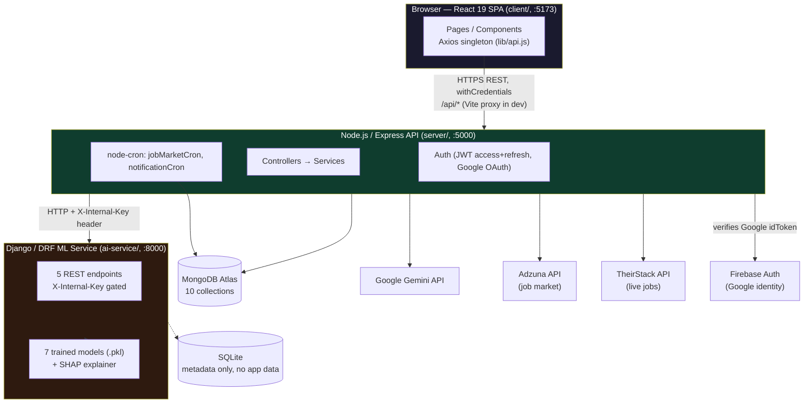
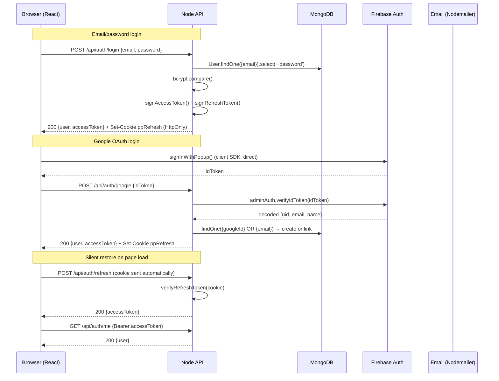
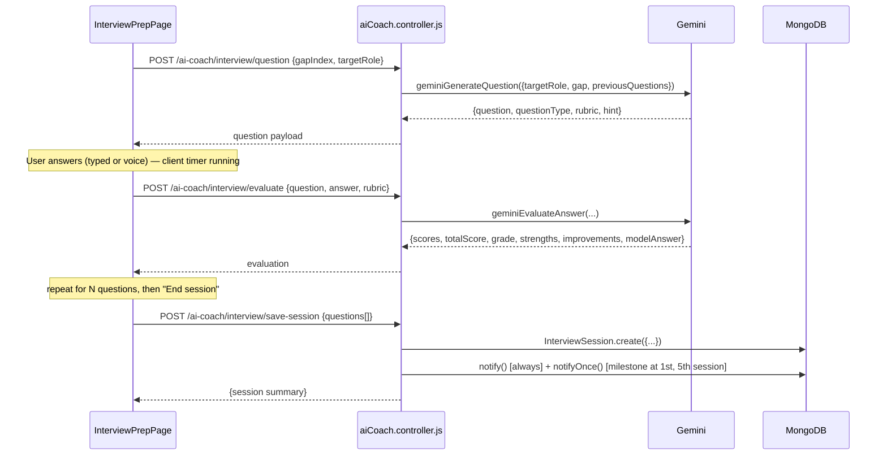
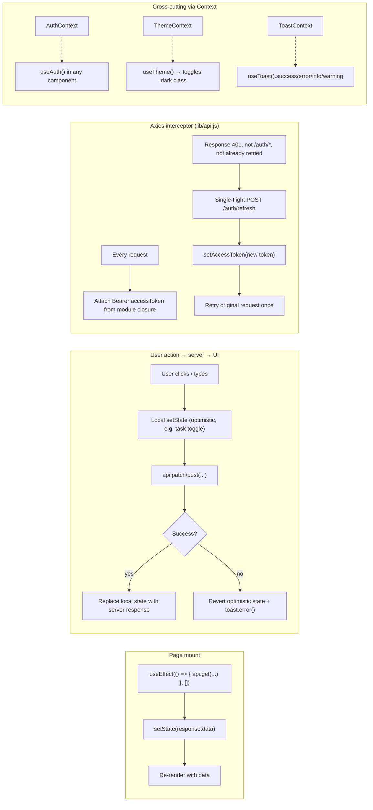

# PathPilot AI — Complete Architecture & Study Guide

> Compiled from a full live-code audit on 2026-07-28. This document supersedes `pathpilot_onboarding.md` (which is stale — it predates Resume Builder, Google OAuth, Peer Benchmarking, Interview Analytics, the light/dark theme system, and the Flight Deck auth redesign, and describes an outdated forest-green color palette).

---

## Table of Contents

1. [Project Overview](#1-project-overview)
2. [Folder & File Map](#2-folder--file-map)
3. [Feature-by-Feature Breakdown](#3-feature-by-feature-breakdown)
4. [Database Schema](#4-database-schema)
5. [API Reference](#5-api-reference)
6. [State Management / Data Flow](#6-state-management--data-flow)
7. [Configuration & Environment](#7-configuration--environment)
8. [Glossary & Key Concepts](#8-glossary--key-concepts)
9. [Quiz Yourself](#9-quiz-yourself)

---

## 1. Project Overview

### What it does

PathPilot AI is a **career intelligence platform** aimed at students (primarily India-focused, given the LPA salary units and Adzuna/TheirStack India market data) preparing to enter the job market. A student:

1. Registers and completes a 2-step onboarding wizard (target role + starting skills).
2. Uploads a resume, which is parsed and scored by a rule-based Django parser, cross-checked/repaired by Gemini, and scanned for recruiter red flags.
3. Gets a composite **Path Score** (0–100) blending resume quality, skills, projects, and profile completeness.
4. Sees a **skill gap analysis** against their target role, backed by live job-market keyword frequency data (Adzuna).
5. Gets an AI-generated **week-by-week learning roadmap** that preserves completion state across regenerations.
6. Practices with an **AI mock interview coach** (Gemini-generated questions, voice dictation, rubric-scored answers, session analytics).
7. Builds a resume from scratch/import/migrate in a live **Resume Builder** with AI bullet rewriting, JD matching, and PDF/DOCX/text export.
8. Tracks applications on a **Kanban board** (wishlist → applied → OA → interview → HR → offer/rejected), enriched with an ML-derived fit score.
9. Compares themselves anonymously to **peers** targeting the same role.
10. Can publish a **public shareable career card**.

Admins get a separate panel for platform stats and user management.

### Tech stack and why

| Layer | Stack | Why |
|---|---|---|
| **Frontend** | React 19.2, Vite 8.1, React Router 7.18, Tailwind CSS v4.3 (CSS-first `@theme`, no `tailwind.config.js`), Framer Motion 12, Recharts 3.9, Axios 1.18, Firebase JS SDK 12 (Google popup only), react-markdown + remark-gfm, driver.js (product tour) | Fast SPA dev loop (Vite), modern React concurrent features, Tailwind v4's native CSS variable theming powers the light/dark toggle without a JS theme provider re-render, Framer Motion for the extensive micro-animation system, Recharts + hand-rolled SVG (`ScoreGauge`) for data viz |
| **Backend API** | Node.js (ESM, `"type": "module"`), Express 4.21, Mongoose 8.9, JWT (`jsonwebtoken`) dual-token auth, bcryptjs, Multer (file uploads), Zod (validation), node-cron (schedulers), Nodemailer, `@google/genai` 2.11 (Gemini SDK), `firebase-admin` 14 (Google OAuth token verification), `@react-pdf/renderer` + `docx` (export) | Express is the thin, well-understood REST layer; Mongoose gives schema validation over MongoDB's flexible documents (useful since resume/roadmap shapes are naturally document-like); JWT access+refresh split balances security and UX; Zod centralizes input validation instead of scattering `if` checks across controllers |
| **Database** | MongoDB Atlas | Document model fits nested, variable-shape data (resume sections, roadmap weeks/tasks, opportunity timelines) without heavy joins |
| **ML microservice** | Python 3, Django 5.1+/DRF 3.15+, scikit-learn, XGBoost, LightGBM, CatBoost, SHAP, pandas/numpy/joblib | Django/DRF is a thin, stateless JSON API — the framework itself does almost nothing here (no admin UI, no auth, no templates) except host 5 REST endpoints in front of trained model artifacts; Python is the ecosystem for the ML libraries used |
| **LLM** | Google Gemini (`gemini-3.5-flash`, falls back to `gemini-3.1-flash-lite` on quota errors) via `@google/genai` | Handles everything that needs natural-language understanding or generation: resume role-fit analysis, interview Q&A, coaching chat, resume-builder writing assistance |
| **External APIs** | Adzuna (job market skill-frequency + salary, weekly cron), TheirStack (live job openings, 6h cache), Firebase Auth (Google identity only) | Ground the app's advice in real market data instead of static lists |

### High-level architecture



**Key architectural rule enforced in code**: the browser never talks to Django directly — `server/src/services/ai.service.js` is the single gateway, and Django's `require_internal_key` decorator (`ml/views.py`) rejects any request lacking the shared `X-Internal-Key` header. Node also never calls Django's axios client from anywhere except `ai.service.js`.

**Inconsistency flagged**: `server/src/routes/index.js`'s JSDoc header says "Mounts all 16 domain sub-routers," but it actually mounts **17** (`resumeBuilderRoutes` was added later and the comment wasn't updated).

---

## 2. Folder & File Map

```
pathpilot-ai/
├── client/                          React 19 + Vite 8 SPA
│   ├── index.html                   Pre-paint inline theme script (reads localStorage before first paint)
│   ├── vite.config.js                Dev proxy /api,/uploads → :5000; "@" → src/
│   ├── src/
│   │   ├── main.jsx                  ReactDOM root; wraps <App> in AuthProvider + ToastProvider
│   │   ├── App.jsx                   All routes; lazy-loads every page except auth pages
│   │   ├── index.css                 Tailwind v4 @theme tokens, light/dark palettes, Flight Deck CSS, all shared component classes
│   │   ├── context/
│   │   │   ├── AuthContext.jsx       Global user/session state, silent refresh-on-mount
│   │   │   ├── ThemeContext.jsx      Light/dark toggle, persists to localStorage, toggles .dark on <html>
│   │   │   └── ToastContext.jsx      Global toast notification queue
│   │   ├── routes/guards.jsx         ProtectedRoute, PublicOnlyRoute, RequireOnboarding, RequireAdmin, StudentOnlyRoute
│   │   ├── lib/
│   │   │   ├── api.js                Axios singleton: Bearer header injection + single-flight 401→refresh→retry
│   │   │   ├── cn.js                 clsx-style className merge helper
│   │   │   ├── jobMatch.js           Client-side job↔skill match-tier scoring (MATCH_TIERS)
│   │   │   ├── motion.js             Shared Framer Motion variants (fadeInUp, staggerContainer)
│   │   │   └── useSavedJobs.js       localStorage-backed "saved jobs" hook
│   │   ├── config/
│   │   │   ├── careerData.js         BRANCHES, SEMESTERS, DREAM_ROLES, COMMON_SKILLS (presentational only)
│   │   │   ├── nav.js                Top-nav link definitions (legacy; AppShell has its own inline copy)
│   │   │   ├── faqData.js            FAQ content shared by AuthLayout preview + /faq page
│   │   │   ├── learningResources.js  Curated learning links per skill, used in roadmap task rows
│   │   │   └── firebase.js           Firebase client SDK init + signInWithGoogle()
│   │   ├── pages/
│   │   │   ├── auth/                 LoginPage, RegisterPage, ForgotPasswordPage, ResetPasswordPage, VerifyEmailPage
│   │   │   ├── OnboardingPage.jsx    2-step wizard (dreamRole, skills)
│   │   │   ├── OverviewPage.jsx      /dashboard — Path Score, peer benchmark, AI narrative, smart CTA, live jobs widget
│   │   │   ├── TalentAnalyzerPage.jsx /talent-analyzer — upload, AI role analysis, red flags, market alignment, live jobs
│   │   │   ├── ExecutionEnginePage.jsx /execution-engine — roadmap + Kanban + market radar
│   │   │   ├── InterviewPrepPage.jsx  /interview-prep — practice session + InterviewAnalytics tab
│   │   │   ├── ResumeBuilderPage.jsx  /resume-builder — landing modes ↔ Editor
│   │   │   ├── CareerReportPage.jsx   /report — printable report (window.print())
│   │   │   ├── ProfilePage.jsx        /profile — profile fields, avatar, password, public card toggle
│   │   │   ├── PublicProfilePage.jsx  /profile/:publicCardId — public card, no auth, sets OG meta tags
│   │   │   ├── AdminPage.jsx          /admin — stats + user management table
│   │   │   ├── FAQPage.jsx            /faq — standalone, no AppShell (reachable by guests)
│   │   │   └── NotFoundPage.jsx       404 catch-all
│   │   └── components/
│   │       ├── layout/
│   │       │   ├── AppShell.jsx      TopNav, NotificationBell, AICoachFab + drawer, wraps every authenticated page
│   │       │   ├── AuthLayout.jsx    "Flight Deck" cockpit shell for all /login,/register,etc. pages (fixed-dark theme, radar constellation, FAQ preview)
│   │       │   ├── Footer.jsx        App footer (links to FAQ, contact)
│   │       │   └── ContactModal.jsx  Contact/feedback modal
│   │       ├── agents/AgentConstellation.jsx  Radar-style animated display of the 7 "AI agents" on the login page
│   │       ├── charts/               ScoreGauge (hand-rolled SVG), ScoreHistogram, SkillRadar, TrendLine, FactorBars, chartTheme.js
│   │       ├── dashboard/PeerBenchmarkCard.jsx  Collapsible peer comparison card
│   │       ├── interview/InterviewAnalytics.jsx Score trend + topic radar + session review drawer
│   │       ├── jobs/JobCard.jsx      Shared job listing card (full/compact variants)
│   │       ├── opportunity/OpportunityModal.jsx Kanban card create/edit modal
│   │       ├── resume/HealthBreakdown.jsx  Resume health factor bars (legacy component)
│   │       ├── resumeBuilder/
│   │       │   ├── LandingModes.jsx  3-mode entry screen (scratch/import/migrate)
│   │       │   ├── Editor.jsx        Split-panel section editor + autosave + AI actions
│   │       │   ├── AtsPanel.jsx      Live heuristic ATS score sidebar
│   │       │   ├── JdMatcher.jsx     Paste-a-JD keyword matcher
│   │       │   ├── TemplateSwitcher.jsx  Template picker with thumbnails
│   │       │   └── templates.jsx     Minimal/Modern/Classic live-preview React templates
│   │       ├── tour/AppTour.jsx      driver.js-powered first-login product tour
│   │       ├── ErrorBoundary.jsx     Class component; wraps the whole router; friendly crash screen
│   │       ├── FAQSection.jsx        Reusable accordion (used in AuthLayout preview + /faq)
│   │       └── ui/                   Button, Card, Input, Select, Spinner, Stepper, TagInput, Avatar, FileUpload, Tooltip, EmptyState, ConfidenceTag, GoogleLogo, Logo, icons.jsx (hand-rolled SVG icon library — no external icon package)
│   └── public/                       favicon.svg, icons.svg, test_avatar.png
│
├── server/                          Node.js / Express API
│   ├── src/
│   │   ├── index.js                  Bootstrap: connectDB() → createApp() → listen() → start crons → graceful shutdown
│   │   ├── app.js                    Express factory: CORS, body/cookie parsing, static avatar serving, auth-gated resume file serving, /api mount, error handlers
│   │   ├── config/
│   │   │   ├── env.js                Single source of truth for all env vars (typed, defaulted)
│   │   │   ├── db.js                 Mongoose connect + public-DNS SRV fix for Windows/ISP DNS blocks
│   │   │   └── firebase.js           firebase-admin init (verifies Google idTokens)
│   │   ├── routes/                   17 route files, all mounted under /api in routes/index.js
│   │   ├── controllers/              16 files, one per domain (see Section 5 for full list)
│   │   ├── models/                   10 Mongoose models (see Section 4)
│   │   ├── services/                 Business logic: gemini.service.js (all LLM calls), ai.service.js (only Django gateway), pathScore.service.js, resumeText.service.js (PDF/DOCX extraction), resumeRedFlags.js, resumeBuilderAts.service.js, resumeBuilderExport.service.js, notification.service.js + notificationCron.js, jobMarket.service.js + jobMarketCron.js, liveJobs.service.js, peerBenchmark.service.js, growth.service.js, insights.service.js, token.service.js, email.service.js
│   │   ├── middleware/                auth.middleware.js (protect/authorize), upload.middleware.js (Multer), validate.middleware.js (Zod), error.middleware.js
│   │   ├── validators/                Zod schemas: auth, profile, path/gap/roadmap
│   │   ├── utils/                     ApiError.js, ApiResponse.js, asyncHandler.js
│   │   └── scripts/                   seed.js (demo data), assorted one-off test/extraction scripts
│   └── uploads/                       Runtime file store: resumes/ (auth-gated), avatars/ (public)
│
├── ai-service/                      Django / DRF ML microservice
│   ├── manage.py
│   ├── config/                       settings.py, urls.py, wsgi.py, asgi.py
│   ├── ml/
│   │   ├── views.py                  5 endpoints, all behind require_internal_key except /health
│   │   ├── urls.py
│   │   ├── services/
│   │   │   ├── resume_parser.py      Regex/heuristic section splitter + skill extractor + 100-pt health score
│   │   │   ├── career_analysis.py    normalize_skills(), analyze_skill_gap(), predict_readiness() (heuristic, not ML)
│   │   │   ├── growth_planner.py     Deterministic week-packing roadmap builder (8h/week target)
│   │   │   ├── predictor.py          Loads all 7 .pkl models once; predict_all() orchestrator
│   │   │   └── explainer.py          SHAP TreeExplainer wrapper
│   │   ├── data/
│   │   │   ├── roles.py              ROLE_REQUIREMENTS: role → [{skill, priority, hours}] (curated, not ML)
│   │   │   └── skills.py             SKILL_ALIASES canonical-name lookup dictionary
│   │   ├── models/                   Trained artifacts: resume_score/, ats/, career/, role/, interview/, salary/, learning/ (each with model.pkl + scaler.pkl + features.pkl + metadata.json), plus peer_benchmarks.json
│   │   ├── training/                 train_all.py + one train_*.py per model (build-time tooling, not runtime)
│   │   ├── utils/                    feature_engineering.py (shared feature columns + extract_resume_features runtime extractor), dataset_generator.py, build_peer_benchmarks.py
│   │   ├── datasets/                 Synthetic training CSVs (regenerable, not committed data source of truth)
│   │   └── notebooks/, reports/, scratch/, tests/   EDA notebook, training plots, dev scripts
│   └── db.sqlite3                    Django metadata only — never touched by the app's real data path
│
└── catboost_info/                   Stale CatBoost training-run logs at repo root — NOT a live service, side effect of a past training run
```

### Entry points

| Entry point | Triggers |
|---|---|
| `client/src/main.jsx` | Mounts `<App>` inside `<AuthProvider><ToastProvider>`; `client/index.html` runs a synchronous inline script before this to set the `.dark` class pre-paint |
| `server/src/index.js` | `connectDB()` → `createApp()` → `app.listen()` → `startJobMarketCron()` → `startNotificationCron()` → SIGINT/SIGTERM graceful shutdown handlers |
| `ai-service/manage.py runserver` | WSGI via `config/wsgi.py` → `config/urls.py` (`api/` prefix) → `ml/urls.py` |

---

## 3. Feature-by-Feature Breakdown

### 3.1 Authentication (email/password + Google OAuth)

**Lives in**: `client/src/pages/auth/*`, `client/src/context/AuthContext.jsx`, `client/src/config/firebase.js` · `server/src/controllers/auth.controller.js`, `oauth.controller.js` · `server/src/services/token.service.js`, `email.service.js` · `server/src/config/firebase.js` · `server/src/models/User.js`

**Session model**: dual JWT.
- **Access token** (15 min default) — returned in the JSON response body, held in memory + `localStorage` (`pp_access_token`), sent as `Authorization: Bearer <token>`.
- **Refresh token** (7 days default) — `HttpOnly`, `secure` in prod, scoped to `path: '/api/auth'`, cookie name `ppRefresh`.

**Google OAuth path**: the client calls Firebase's `signInWithPopup()` directly (client-side, never touches the Node server for the popup itself), gets a Firebase `idToken`, and POSTs it to `/api/auth/google`. `oauth.controller.js` verifies the token server-side with `firebase-admin`, finds-or-creates a `User` (linking an existing local account by email if one exists), and issues the exact same dual-JWT session as password login via the shared `issueSession()` helper exported from `auth.controller.js`.

**Business logic / gotchas**:
- Registration always succeeds even if the verification email fails to send (try/catch around `sendVerificationEmail`, logs a warning). In dev without SMTP configured, `email.service.js` logs the email to the console instead of sending.
- `forgotPassword` always returns the same success message whether or not the account exists — deliberate to prevent user enumeration.
- `User.comparePassword()` returns `false` immediately (no bcrypt call) for Google-only accounts with `password: null`.
- Client-side: `AuthContext` on mount calls `POST /auth/refresh` (using the cookie) to silently restore a session, then `GET /auth/me` to load the user — this is what prevents a login-page flash on reload.



### 3.2 Onboarding

**Lives in**: `client/src/pages/OnboardingPage.jsx` · `server/src/controllers/onboarding.controller.js`

A deliberately short 2-step wizard — **not** a resume upload flow. Captures only `dreamRole` and `skills`, sets `user.onboardingCompleted = true`, and immediately calls `recomputePathScoreCache()` so the freshly-set `dreamRole` is available to Peer Benchmarking right away (a user with no cached score can't be grouped into a role's peer pool). `RequireOnboarding` (guards.jsx) redirects any logged-in-but-not-onboarded user here before they can reach any feature page.

### 3.3 Resume Upload & Analysis (the most important flow)

**Lives in**: `client/src/pages/TalentAnalyzerPage.jsx` · `server/src/controllers/resume.controller.js` · `server/src/services/resumeText.service.js`, `ai.service.js`, `resumeRedFlags.js`, `gemini.service.js`, `pathScore.service.js`, `notification.service.js` · `ai-service/ml/services/resume_parser.py` · `server/src/models/Resume.js`

This is the flow everything else (Path Score, Gap Analysis, Roadmap, Interview gaps) depends on.

**Pipeline** (`POST /api/resume/analyze`, `resume.controller.js → analyzeResume()`):

1. **Upload** — `upload.middleware.js` (Multer) saves the file to `uploads/resumes/<userId>-<timestamp>-<random>.<ext>`, whitelist-checks MIME type (PDF/DOC/DOCX), caps at 5 MB.
2. **Text extraction** — `resumeText.service.js`. For PDF: coordinate-aware column-sorting via `pdfjs-dist` transform matrices (detects and correctly orders 2-column layouts), plus PDF URI-annotation link extraction and a regex URL fallback scan. Falls back to `pdf-parse` if the coordinate-based path throws. For DOCX: `mammoth.extractRawText()`.
3. **Django parse** (primary) — `aiService.parseResume({text, links})` → `ai-service/ml/services/resume_parser.py`. Regex-based section-header detection, skill extraction via `SKILL_ALIASES`, project title/bullet segmentation, contact extraction (with truncated-URL repair for PDF link annotations), and a 100-point explainable health score across 7 factors (contact & links 15, skills 20, education 15, experience 15, projects 15, impact language 10, length 5).
4. **Gemini fallback parser** — triggered if Django's word count is < 30 (`lowText: true`) or returns zero skills AND zero projects. `geminiParseFallback()` re-extracts the same schema from raw text via an LLM prompt — this catches multi-column/table layouts the regex parser mishandles.
5. **Gemini sanity-check pass** — `geminiValidateParsedResume()` runs whenever there's any content to validate. Compares parsed fields back against raw text, corrects obvious extraction errors, and flags fields it's still not confident about into `lowConfidenceFields[]` (surfaced in the UI as a "please verify" hint next to that section).
6. **Red flag detection** — `resumeRedFlags.js`, pure heuristics, no AI: missing contact/LinkedIn/GitHub, generic objective clichés, < 25% of bullets contain a quantified metric, inconsistent date formats, unexplained 3+ year gaps.
7. **Gemini role-fit intelligence** — `geminiAnalyzeResume({resumeText, parsedData, targetRole, skills})` → `roleFitScore`, `keyGaps`, `strengthAreas`, `atsKeywordsMissing`, `recommendations`, `nextStepPriority`. If Gemini is rate-limited/down, falls back to `getLocalResumeFallback()` — a deterministic heuristic that maps the target role to a skill cluster (Frontend/Backend/Data) and computes overlap.
8. **Persist** — `Resume.create({...})`. Resume history is never overwritten; the UI always reads the newest via `.sort({createdAt: -1})`.
9. **Pre-generate AI narrative** — `geminiExplainScore()` writes a 3–4 paragraph coaching narrative, cached on `resume.aiNarrative` so the dashboard doesn't call Gemini on every page load. Wrapped in try/catch — upload succeeds even if this step fails.
10. **Notifications** — always creates a "Resume Processed" notification; a `notifyOnce()` milestone notification on the very first resume ever analyzed; and if the cached Path Score moved by ≥5 points from the previous cached value, a score-delta notification.

**Critical invariant**: `resume.aiNarrative` is generated against the `dreamRole` at upload time. Any code path that changes `user.profile.dreamRole` (profile update, role re-analysis) **must** clear `aiNarrative` to `''` or the dashboard shows coaching text for the wrong role. This is done in `profile.controller.js → updateProfile()` and `resume.controller.js → reanalyzeForRole()`.

```mermaid
sequenceDiagram
    participant C as TalentAnalyzerPage
    participant N as resume.controller.js
    participant TX as resumeText.service.js
    participant D as Django resume_parser.py
    participant G as gemini.service.js
    participant M as MongoDB

    C->>N: POST /resume/analyze (multipart file)
    N->>TX: extractResumeText(path, name)
    TX-->>N: {text, links}
    N->>D: aiService.parseResume({text, links})
    D-->>N: {skills, education, projects, health, ...}
    alt lowText or 0 skills/projects
        N->>G: geminiParseFallback(text)
        G-->>N: replacement parsed object
    end
    N->>G: geminiValidateParsedResume({rawText, parsed})
    G-->>N: corrected fields + lowConfidenceFields[]
    N->>N: detectRedFlags(text, parsed)
    N->>G: geminiAnalyzeResume({resumeText, parsedData, targetRole})
    G-->>N: {roleFitScore, keyGaps, strengthAreas, ...}
    N->>M: Resume.create({...})
    N->>G: geminiExplainScore({user, resume, pathScore})
    G-->>N: aiNarrative text
    N->>M: resume.aiNarrative = text; save()
    N->>M: recomputePathScoreCache(user, resume)
    N->>M: Notification.create(...) [+ milestone/delta notifications]
    N-->>C: 201 {resume}
```

### 3.4 Path Score & Dashboard

**Lives in**: `client/src/pages/OverviewPage.jsx` · `server/src/controllers/pathScore.controller.js` · `server/src/services/pathScore.service.js`, `peerBenchmark.service.js`, `jobMarket.service.js`

`buildPathScore(user, resume)` is a **pure function** — always recomputed from live `user`/`resume` data, never trusted from a stale field, with one exception: `user.pathScoreCache` is a deliberate cache used only by Peer Benchmarking and Smart Notifications (which both need a fast cross-user aggregate or a "previous value to diff against," which live recomputation doesn't provide). The cache is refreshed at natural trigger points (resume analyzed, profile/role updated, onboarding completed) and opportunistically on `GET /api/path-score` if older than 10 minutes (`isPathScoreCacheStale`).

**Formula** (4 weighted factors, sum = 0–100):
| Factor | Weight | Formula |
|---|---|---|
| Resume Quality | 35 | `(resume.healthScore / 100) × 35` |
| Skills | 25 | `(min(skillCount, 10) / 10) × 25` |
| Projects | 20 | `(min(projectCount, 3) / 3) × 20` |
| Profile Completion | 20 | `(completedChecks / 3) × 20` (dreamRole set, skills present, resume uploaded) |

Readiness labels: **Career-ready** (≥85) → **Interview-ready foundation** (≥70) → **Building momentum** (≥50) → **Needs foundation** (>0) → **Unscored** (0).

`GET /api/path-score` also calls Django's unified `/predict/` endpoint (all 7 ML models) as a **non-authoritative supplementary layer** — the ML `careerReadiness.level`/`.summary` and `peerBenchmark` (a separate, older per-role percentile system baked into the trained models via `peer_benchmarks.json`, distinct from the newer `peerBenchmark.service.js`) are attached without ever overwriting `pathScore.score`/`displayScore`. Also blends in live Adzuna market-skill match rate and salary range.

**Known-bug-class the codebase explicitly guards against** (documented in `insights.controller.js`'s own comments): never call `buildPathScore()` a second time in a different controller and treat it as "the" score — always read `resume.pathScore` equivalent or recompute identically. `insights.controller.js` does call `buildPathScore()` itself (it's the same pure function, so this is safe), but explicitly avoids introducing a second, differently-weighted scoring path.

### 3.5 Skill Gap Analysis & Market Alignment

**Lives in**: `server/src/controllers/gap.controller.js` · `ai-service/ml/services/career_analysis.py` (`analyze_skill_gap`) · `ai-service/ml/data/roles.py` (curated `ROLE_REQUIREMENTS`, not ML-derived) · `server/src/services/jobMarket.service.js`

`POST /api/gap/analyze` runs Django's gap analysis and the live Adzuna market snapshot **in parallel** (`Promise.all`), then merges: each missing/matched skill gets a `marketFrequency` percentage attached, and missing skills are sorted by priority tier first (`core` > `recommended` > `supporting`), then by market frequency descending. `ensureGapRecommendations()` provides a fallback recommendation list ("Learn X — ~Yh") if Django didn't supply one.

### 3.6 Learning Roadmap (Skill Roadmap)

**Lives in**: `client/src/pages/ExecutionEnginePage.jsx` (Roadmap section) · `server/src/controllers/growth.controller.js` · `server/src/services/growth.service.js` · `ai-service/ml/services/growth_planner.py` · `server/src/models/GrowthPlan.js`

`growth_planner.py` packs missing skills into week blocks targeting ~8 hours/week (`WEEKLY_HOURS`), starting a new week whenever adding the next task would overflow. If the student already covers 100% of the role's skill map, a single "Capstone: prove your skills" week is returned instead of an empty roadmap.

**Progress preservation across regenerations** — the reason `key` fields matter: when a student regenerates their roadmap (new resume, new role), `growth.service.js → preserveCompletion()` builds a `Map` of already-completed task keys from the *old* plan and re-applies `completed`/`completedAt` to any task in the *new* plan sharing the same stable `key` (e.g. `"react"`, kebab-cased from the skill name). Gemini-generated gap-specific tasks use `gap-task-<timestamp>-<random>` as their key — these are intentionally **not** stable across regenerations, so gap weeks are always regenerated fresh at the top of the plan when `generateGrowthPlan` detects the roadmap's target role matches the user's current `dreamRole` and the latest resume has `keyGaps`.

### 3.7 AI Mock Interview Coach

**Lives in**: `client/src/pages/InterviewPrepPage.jsx`, `client/src/components/interview/InterviewAnalytics.jsx` · `server/src/controllers/aiCoach.controller.js` · `server/src/services/gemini.service.js` · `server/src/models/InterviewSession.js`

Practice loop: `POST /ai-coach/interview/question` (Gemini generates a question targeting one of the resume's `keyGaps`, tagged `questionType: technical|behavioral|situational`) → user answers (typed or via `webkitSpeechRecognition` voice dictation, with a live 24-bar animated waveform while listening) → `POST /ai-coach/interview/evaluate` (Gemini scores relevance/depth/communication against a rubric, returns a letter grade, strengths, improvements, and a model answer) → repeat → `POST /ai-coach/interview/save-session` persists the full transcript, fires a completion notification every time, and a milestone notification at the 1st and 5th completed sessions.

Client-side speech metrics (not sent to Gemini, computed locally from the transcript + elapsed timer): words-per-minute pace classification (Optimal 110–160 WPM) and filler-word count (`um|uh|like|basically|actually|so`).

**Analytics tab** (`GET /ai-coach/interview/analytics`) aggregates every saved session: score-over-time trend line, per-topic-category average score (rendered as a radar chart once 3+ categories have data, else bars), an "improvement highlight" (compares the most recent 3 answers vs the prior 3 within the topic with the most data, needs 6+ answers in one category), and a "recommended focus" (the topic category with the lowest average score).



### 3.8 Resume Builder

**Lives in**: `client/src/pages/ResumeBuilderPage.jsx`, `components/resumeBuilder/*` · `server/src/controllers/resumeBuilder.controller.js` · `server/src/services/resumeBuilderAts.service.js`, `resumeBuilderExport.service.js` · `server/src/models/ResumeBuilder.js`

**Deliberately a separate collection from `Resume`**: `Resume` is an immutable AI-analysis snapshot regenerated wholesale on every upload; `ResumeBuilder` is a single live, hand-edited draft per user (`unique: true` on `user`, upsert pattern). Conflating the two would mean a fresh resume upload silently overwrites hand-edited builder content.

**Three entry modes**, all converging on the same `Editor.jsx`:
- **scratch** — empty editor, contact name/email pre-filled from the account.
- **import** — copies from the latest analyzed `Resume` document (`buildSectionsFromParsed`), one-time copy at creation — the two documents are independent after that.
- **migrate** — uploads a fresh PDF/DOCX, extracts text via the same `resumeText.service.js`, and parses it via `geminiParseFallback()` (not Django — the builder path always uses Gemini for migrate-mode parsing).

**Live ATS score** (`resumeBuilderAts.service.js`) is a **deterministic heuristic, not AI** — recomputed synchronously on every save so it can update on every keystroke-driven autosave without burning Gemini quota: `overall = keywordMatch×0.4 + bulletStrength×0.35 + readability×0.25`. Target keywords are sourced from `getMarketDataForRole()` — the same live Adzuna data the Gap Analysis feature uses, keeping "in-demand keywords" consistent app-wide. Bullet strength checks for a leading action verb + a digit (proxy for a quantified metric); readability checks bullets are 8–25 words.

**AI-assisted writing** (all Gemini-backed, in `gemini.service.js`): `geminiRewriteBullet` (one bullet, single-line, no invented numbers), `geminiGenerateResumeSummary`, `geminiOptimizeResume` (full-draft scan returning suggested bullet rewrites the user applies individually — never silently overwrites content), `geminiMatchJobDescription` (paste-a-JD keyword match %), `geminiInsertKeywords` (weaves missing keywords into the summary naturally).

**Autosave**: `Editor.jsx` updates local state instantly on every keystroke, then debounces a `PATCH /resume-builder` by 600ms. The server response (with a freshly recomputed `atsScore`) replaces local state — this is what makes the ATS panel feel live without a request per keystroke.

**Export**: three formats sharing one document — PDF via `@react-pdf/renderer` (three hand-built React-tree templates: Minimal/Modern/Classic, rendered server-side with `renderToBuffer`, no Puppeteer), DOCX via the `docx` package (structured, not an HTML dump), and plain text (for pasting into job-portal text boxes).

### 3.9 Job-Application Kanban & Live Jobs

**Lives in**: `client/src/pages/ExecutionEnginePage.jsx` (Kanban + Market Radar sections), `TalentAnalyzerPage.jsx` (Live Jobs tab) · `server/src/controllers/opportunity.controller.js`, `liveJobs.controller.js` · `server/src/services/liveJobs.service.js` · `server/src/models/Opportunity.js`, `LiveJobCache.js`

**Kanban**: 7 stages (`wishlist → applied → oa → interview → hr → offer → rejected`), native HTML5 drag-and-drop (`draggable` + `dataTransfer`). Every stage change pushes a `timelineEntrySchema` entry, creating a full audit trail. `fitScore` is computed by `calculateOpportunityFit()` on create and on role change: `score = roleFit×0.3 + atsPass×0.35 + interviewSuccess×0.35`, sourced from Django's unified `/predict/` response, with a graceful `{score: 50, tier: 'low'}` fallback if the AI service is unreachable.

**Live jobs** (TheirStack API): **two-layer cache** to protect the free-tier 200-credits/month budget — Layer 1 is an in-memory `Map` (fastest, cleared on server restart), Layer 2 is `LiveJobCache` in MongoDB with a TTL index (`expireAfterSeconds: 21600`, i.e. 6 hours) so the cache survives restarts and is shared across server instances. Both layers use the same 6-hour expiry constant, kept in sync manually (`CACHE_TTL_MS` in the service, `CACHE_TTL_SECONDS` in the model — a spot where a future refactor could accidentally desync them).

### 3.10 Peer Benchmarking

**Lives in**: `client/src/components/dashboard/PeerBenchmarkCard.jsx` · `server/src/services/peerBenchmark.service.js` · `server/src/controllers/pathScore.controller.js` (`GET /path-score/peer-benchmark`)

Aggregates every other user's **cached** Path Score (`user.pathScoreCache`) sharing the same `dreamRole` (case-insensitive regex match), in-memory cached per role for 1 hour (`roleCache` Map, mirrors the `liveJobs.service.js` caching pattern). Only ever returns aggregate statistics — no peer names/IDs/emails ever leave the service. Hidden entirely (`available: false, reason: 'not_enough_peers'`) below `MIN_PEER_SAMPLE = 5` peers, both because a percentile among 1–2 people is statistically meaningless and because it would be close to identifying a specific other student. Returns: percentile (`betterThanPercent`/`topPercent`, clamped so a perfect score never reads "top 0%"), a 5-bucket score histogram, "N points from top 10%," and a per-factor above/below/about-average comparison.

### 3.11 Smart Notifications

**Lives in**: `server/src/services/notification.service.js`, `notificationCron.js` · `server/src/models/Notification.js`, `JobAlertState.js`

Two creation helpers used everywhere: `notify()` (always creates) and `notifyOnce()` (creates only if no notification with the same `title` exists for that user within a `lookbackDays` window — the app-wide dedup mechanism for milestones and recurring cron checks).

**Four scheduled cron triggers** (`node-cron`, all registered once in `startNotificationCron()`):
| Trigger | Schedule | Logic |
|---|---|---|
| `runDailyJobAlerts` | Daily 09:00 | Per tracked role (not per user — protects TheirStack credit budget), diffs live job IDs against `JobAlertState.notifiedJobIds` (capped at 300 entries), notifies every user targeting that role once if new IDs found |
| `runStaleResumeCheck` | Daily 09:15 | Users whose latest resume is 30+ days old get a `notifyOnce` reminder (recurs roughly monthly) |
| `runSkillTrendCheck` | Weekly, Sunday 03:00 (1h after the market-data refresh) | Compares this week's vs last week's `JobMarketSnapshot` frequency per skill; flags ≥15 percentage-point jumps as "trending" |
| `runWeeklyDigest` | Weekly, Monday 08:00 | Path Score + interview sessions this week + top skill gap, one summary notification per onboarded user |

Plus **inline triggers** fired directly from feature controllers: resume-analyzed success + first-resume milestone + score-delta (`resume.controller.js`), first-gap-analysis milestone (`gap.controller.js`), interview-session-complete + 1st/5th-session milestones (`aiCoach.controller.js`), wishlist-added info toast (`opportunity.controller.js`), and a **lazy weekly check-in** computed opportunistically inside `GET /api/notifications` itself (`notification.controller.js`) rather than a dedicated cron — checks if the user hasn't updated their profile or an opportunity in 7 days.

### 3.12 AI Career Coach Chat

**Lives in**: `client/src/components/layout/AppShell.jsx` (floating FAB + drawer) · `server/src/controllers/aiCoach.controller.js` (`chat`, `explainScore`)

Context-injected chat: `buildUserContext()` (in `gemini.service.js`) constructs a system instruction embedding the user's name, target role, deduplicated skills, resume health/gaps/red-flags summary, and roadmap progress before every message — so the model always "knows" the student's current state without the client sending it explicitly. History is capped to the last 8 turns. Falls back to a generic apology string (not a hard error) if Gemini fails, so a transient outage doesn't break the chat UI. Rendered with `react-markdown` + `remark-gfm`.

### 3.13 Career Report, Public Profile, Admin Panel

- **Career Report** (`/report`, `report.controller.js`) — `Promise.all`-parallel-fetches user/resumes/growthPlan/opportunities, compiles one JSON blob mirroring the dashboard's data, rendered client-side and exported via `window.print()` with a dedicated `@media print` stylesheet (hides nav/buttons, forces `-webkit-print-color-adjust: exact` so badge colors survive printing).
- **Public Profile** (`/profile/:publicCardId`, no auth, `profile.controller.js → getPublicCard`) — looks up by `publicCardId` + requires `isPublicCardEnabled: true`, returns name/role/college/skills/pathScore/factors only (no email, no resume file). Client dynamically rewrites `document.title` and `og:*`/`twitter:*` meta tags for rich social link previews.
- **Admin Panel** (`/admin`, `admin.controller.js`, `authorize('admin')`-gated) — platform stat aggregation (`Promise.all` of 8 `countDocuments` calls + an `Opportunity.aggregate` group-by-stage pipeline), paginated/searchable user table, role mutation (self-demotion blocked), user deletion cascades across `Resume`/`GrowthPlan`/`Opportunity` (self-deletion blocked). **Note**: the cascade delete does *not* clean up `ResumeBuilder`, `InterviewSession`, `Notification`, or uploaded files on disk for the deleted user — those are orphaned.

---

## 4. Database Schema

10 MongoDB collections, all via Mongoose. No collection is ever truly "joined" — the app reads via sequential/parallel queries keyed by `user: ObjectId` and composes in application code.

```mermaid
erDiagram
    USERS ||--o{ RESUMES : "1:N (upload history)"
    USERS ||--|| RESUMEBUILDERS : "1:1 (unique user)"
    USERS ||--|| GROWTHPLANS : "1:1 (unique user)"
    USERS ||--o{ OPPORTUNITIES : "1:N"
    USERS ||--o{ INTERVIEWSESSIONS : "1:N"
    USERS ||--o{ NOTIFICATIONS : "1:N"

    USERS {
        ObjectId _id PK
        string name
        string email UK
        string password "bcrypt, select:false, null for Google accounts"
        string googleId "sparse index"
        string authProvider "local | google"
        string role "student | admin"
        boolean isEmailVerified
        boolean onboardingCompleted
        object profile "embedded: college, branch, semester, dreamRole, skills[], resumeUrl, avatarUrl"
        string publicCardId UK "24-hex, crypto.randomBytes(12)"
        boolean isPublicCardEnabled
        date lastLoginAt
        object pathScoreCache "embedded: score, displayScore, readinessLabel, factors[], computedAt"
    }

    RESUMES {
        ObjectId _id PK
        ObjectId user FK "indexed"
        string fileUrl
        string originalName
        array skills
        array education
        array projects "embedded {title, description}"
        array experience
        array certifications
        object contact "email, phone, linkedin, github"
        number healthScore
        array healthBreakdown "embedded {label, score, max, status, tip}"
        array suggestions
        array redFlags "embedded {key, label, description, fix, severity}"
        number wordCount
        boolean lowText
        array lowConfidenceFields
        number roleFitScore "Gemini layer"
        array keyGaps "Gemini layer"
        array strengthAreas "Gemini layer"
        array atsKeywordsMissing "Gemini layer"
        array aiRecommendations "Gemini layer"
        string nextStepPriority "Gemini layer"
        string aiNarrative "must clear on dreamRole change"
    }

    RESUMEBUILDERS {
        ObjectId _id PK
        ObjectId user FK UK "unique — one draft per user"
        string sourceMode "scratch | import | migrate"
        string template "minimal | modern | classic"
        object contact
        string summary
        array experience "embedded, user-editable"
        array skills
        array projects "embedded, user-editable"
        array education "embedded, user-editable"
        object atsScore "embedded: overall, keywordMatchPercent, readability, bulletStrength, matched/missingKeywords, suggestions, computedAt"
        date lastExportedAt
    }

    GROWTHPLANS {
        ObjectId _id PK
        ObjectId user FK UK "unique"
        string targetRole
        string summary
        number coverageStart
        number totalWeeks
        number totalTasks
        number totalHours
        array strengths
        array weeks "embedded: week#, title, focusHours, tasks[]"
    }

    OPPORTUNITIES {
        ObjectId _id PK
        ObjectId user FK "compound idx with updatedAt"
        string company
        string role
        string stage "wishlist|applied|oa|interview|hr|offer|rejected"
        string url
        string notes
        string salary
        string location
        date appliedAt
        array timeline "embedded {stage, date, note}"
        object fitScore "embedded: score, roleFit, atsPass, interviewSuccess, confidence{tier,score,reason}"
    }

    INTERVIEWSESSIONS {
        ObjectId _id PK
        ObjectId user FK "indexed"
        string targetRole
        array gapsAddressed
        array questions "embedded: question, answer, gapAddressed, questionType, totalScore, grade, strengths, improvements, modelAnswer, timeTakenSeconds"
        number totalQuestions
        number averageScore
        date completedAt
    }

    NOTIFICATIONS {
        ObjectId _id PK
        ObjectId user FK "compound idx: user+read+createdAt"
        string title
        string message
        string type "info | warning | success"
        boolean read
        string actionLink
    }

    JOBMARKETSNAPSHOTS {
        ObjectId _id PK
        string role "indexed, compound w/ weekOf"
        string skill
        number frequency "0-100"
        object avgSalaryRange "min, max in LPA"
        number sampleSize
        date weekOf "Monday of ISO week"
    }

    LIVEJOBCACHES {
        ObjectId _id PK
        string role "unique compound w/ countryCode"
        string countryCode "default 'in'"
        array jobs "embedded, normalized TheirStack listings"
        date fetchedAt "TTL index, expireAfterSeconds:21600"
    }

    JOBALERTSTATES {
        ObjectId _id PK
        string role UK "unique, one row per tracked role"
        array notifiedJobIds "capped at 300"
        date lastCheckedAt
    }
```

**Independent / global collections** (not `user`-scoped): `JobMarketSnapshot`, `LiveJobCache`, `JobAlertState` — all populated by cron jobs or on-demand external API calls, shared across all users.

### Indexes summary

| Collection | Index | Purpose |
|---|---|---|
| `users` | `email: 1` unique, `publicCardId: 1` unique, `googleId: 1` sparse | Login lookup, public card lookup, Google account linking |
| `resumes` | `user: 1` | `.find({user}).sort({createdAt:-1})` |
| `resumebuilders` | `user: 1` unique | Enforce one draft per user, fast upsert |
| `growthplans` | `user: 1` unique | Enforce one plan per user, fast upsert |
| `opportunities` | `{user:1, updatedAt:-1}` compound | Kanban board's main query |
| `interviewsessions` | `user: 1` | Session history query |
| `notifications` | `{user:1, read:1, createdAt:-1}` compound | Notification drawer's main query |
| `jobmarketsnapshots` | `{role:1, weekOf:-1}`, `{role:1, skill:1, weekOf:1}` unique | Latest-week lookup; idempotent weekly upserts |
| `livejobcaches` | `{role:1, countryCode:1}` unique, `{fetchedAt:1}` TTL (21600s) | Cache key lookup; automatic 6h expiry |
| `jobalertstates` | `role: 1` unique | One row per tracked role |

No migrations exist — Mongoose schemas apply on write, and there's no schema-migration tooling in the repo (typical for a MongoDB app of this size; existing documents simply get `default` values for new fields on next save).

---

## 5. API Reference

Base URL: `/api` (Vite dev-proxies to `http://localhost:5000`). All routes except `/health`, `/health/ai`, auth routes, and the public-card/FAQ routes require `Authorization: Bearer <accessToken>` via the `protect` middleware.

### Auth (`/api/auth`) — `auth.routes.js`
| Method | Path | Auth | Purpose |
|---|---|---|---|
| POST | `/register` | rate-limited | Create account, fire-and-forget verification email, issue session |
| POST | `/login` | rate-limited | Verify credentials, issue session |
| POST | `/google` | rate-limited | Verify Firebase idToken, find-or-create user, issue session |
| POST | `/refresh` | cookie | Rotate access token from refresh cookie |
| POST | `/logout` | — | Clear refresh cookie |
| GET | `/me` | ✓ | Return `req.user` |
| POST | `/verify-email` | — | Consume email-verify token |
| POST | `/resend-verification` | ✓ | Re-send verification (or console-log in sandbox mode) |
| POST | `/forgot-password` | rate-limited | Always-success password reset email |
| POST | `/reset-password` | — | Consume reset token, set new password |

### Onboarding (`/api/onboarding`)
| PUT | `/` | ✓ | Set `dreamRole`/`skills`, mark `onboardingCompleted`, warm Path Score cache |

### Profile (`/api/profile`)
| Method | Path | Auth | Purpose |
|---|---|---|---|
| GET | `/public/:publicCardId` | — | Public career card (no auth) |
| GET | `/` | ✓ | Own profile |
| PATCH | `/` | ✓ | Update fields; clears `resume.aiNarrative` if `dreamRole` changed; refreshes Path Score cache |
| PATCH | `/password` | ✓ | Change password (verifies current) |
| PATCH | `/public-card` | ✓ | Toggle public sharing |
| POST | `/avatar` | ✓ | Upload avatar (Multer, 2MB, image only) |
| POST | `/resume` | ✓ | Update resume URL pointer only (not the analysis pipeline) |

### Resume (`/api/resume`)
| POST | `/analyze` | ✓ | Full 10-step upload→parse→analyze pipeline |
| GET | `/` | ✓ | Latest resume |
| GET | `/history` | ✓ | Score-only history across all uploads |
| POST | `/reanalyze` | ✓ | Re-run Gemini role-fit against a new `targetRole` without re-uploading |

### Path Score (`/api/path-score`)
| GET | `/` | ✓ | Composite score + ML predictions + market salary/benchmark blend |
| GET | `/peer-benchmark` | ✓ | Anonymous peer comparison stats |

### Gap Analysis (`/api/gap`)
| POST | `/analyze` | ✓ | Skill gap vs role, market-frequency enriched |

### Growth / Roadmap (`/api/growth`)
| GET | `/` | ✓ | Active plan + progress |
| POST | `/generate` | ✓ | Build/regenerate plan, preserve completion, inject Gemini gap weeks |
| PATCH | `/tasks/:key` | ✓ | Toggle a task's completed state |

### Insights (`/api/insights`)
| GET | `/` | ✓ | Aggregated dashboard analytics (resume trend, growth %, skill distribution, market salary) |

### Opportunities (`/api/opportunities`)
| GET | `/stats` | ✓ | Per-stage counts |
| GET | `/` | ✓ | List all (sorted by `updatedAt`) |
| POST | `/` | ✓ | Create + compute initial fit score |
| PATCH | `/:id` | ✓ | Update fields/stage, push timeline entry, recompute fit if role changed |
| DELETE | `/:id` | ✓ | Delete |

### Notifications (`/api/notifications`)
| GET | `/` | ✓ | List + unread count; lazily fires weekly check-in if due |
| PATCH | `/mark-all` | ✓ | Mark all read |
| PATCH | `/:id` | ✓ | Mark one read |

### AI Coach (`/api/ai-coach`)
| Method | Path | Purpose |
|---|---|---|
| POST | `/explain` | Cached or fresh Gemini Path Score narrative |
| POST | `/chat` | Context-injected coaching chat |
| POST | `/interview/question` | Generate targeted interview question |
| POST | `/interview/evaluate` | Rubric-score an answer |
| POST | `/interview/save-session` | Persist session + fire notifications |
| GET | `/interview/analytics` | Score trend, topic breakdown, insights |
| GET | `/interview/sessions` | History summary list |
| GET | `/interview/sessions/:id` | Full session detail (Q&A) |

### Resume Builder (`/api/resume-builder`)
| Method | Path | Purpose |
|---|---|---|
| GET | `/` | Fetch draft or `{exists:false}` |
| POST | `/init` | Create/reset from scratch\|import\|migrate |
| PATCH | `/` | Update sections, recompute ATS score |
| POST | `/ai/rewrite-bullet` | AI rewrite one bullet |
| POST | `/ai/generate-summary` | AI-generate + save summary |
| POST | `/ai/optimize` | Full-draft AI scan (suggestions only) |
| POST | `/ai/match-jd` | Compare against pasted job description |
| POST | `/ai/insert-keywords` | Weave keywords into summary |
| GET | `/export/pdf` \| `/docx` \| `/text` | Download in format |

### Report (`/api/report`)
| GET | `/` | ✓ | Full compiled career report |

### Job Market (`/api/job-market`)
| GET | `/:role` | Skill frequency demand |
| GET | `/:role/salary` | Salary range (LPA) |
| POST | `/refresh` | Admin-only, force Adzuna refresh across 12 tracked roles |

### Live Jobs (`/api/live-jobs`)
| GET | `/?role=&country=` | Cached/fresh TheirStack listings |
| DELETE | `/cache?role=&country=` | Admin-only cache invalidation |

### Admin (`/api/admin`)
| GET | `/stats` | Platform aggregate stats |
| GET | `/users` | Paginated/searchable user list |
| GET | `/users/:id` | Single user + related counts |
| PATCH | `/users/:id` | Change role (self-demotion blocked) |
| DELETE | `/users/:id` | Delete + cascade (self-deletion blocked) |

### ML pass-through (`/api/ml`)
| POST | `/predict` | Proxies to Django `/predict/` with the caller's resume+profile payload |

### Health
| GET | `/api/health` | Node liveness |
| GET | `/api/health/ai` | Node + Django connectivity check |

### Django ML service (`ai-service`, called only by Node, `X-Internal-Key` header required except `/health/`)
| Method | Path | Purpose |
|---|---|---|
| GET | `/api/health/` | Liveness |
| POST | `/api/resume/parse/` | Rule-based resume sectioning |
| POST | `/api/skills/gap/` | Skill gap vs role |
| POST | `/api/readiness/predict/` | Heuristic readiness score (not the trained model) |
| POST | `/api/roadmap/recommend/` | Deterministic roadmap |
| POST | `/api/predict/` | **Unified**: runs all 7 trained models + SHAP |

---

## 6. State Management / Data Flow

**No Redux, Zustand, or any global store library.** State is split three ways:

1. **React Context** for genuinely cross-cutting concerns: `AuthContext` (user/session), `ThemeContext` (light/dark), `ToastContext` (notification queue).
2. **Local component state** (`useState`/`useEffect`) for everything page-specific — each page independently fetches its own data on mount ("pull-on-mount" pattern, no shared cache/query library like React Query or SWR).
3. **The Axios singleton's module-level closure** (`lib/api.js`) for the access token and the single-flight refresh promise — deliberately outside React state since the interceptor needs synchronous access on every request.



**Optimistic-then-reconcile pattern** example (`ExecutionEnginePage.jsx → toggleTask`): the checkbox flips immediately via local `applyToggle()`, the PATCH fires in the background, and on success the server's authoritative plan (with recomputed progress percentages) replaces local state; on failure the optimistic flip is reverted and a toast fires.

**Cross-tab custom events**: `AppShell.jsx` listens for a `window` CustomEvent `open-ai-coach` (dispatched from anywhere, e.g. a "explain this score" button) to open the AI Coach drawer pre-loaded with an explanation; and `start-app-tour` to manually re-trigger the product tour from the account dropdown regardless of which page it's dispatched from.

---

## 7. Configuration & Environment

### `server/.env` (via `server/src/config/env.js`)

| Variable | Required? | Purpose |
|---|---|---|
| `PORT` | no (default 5000) | Express listen port |
| `NODE_ENV` | no | `development`/`production`/`test` |
| `CLIENT_URL` | no (default `http://localhost:5173`) | CORS allow-list origin |
| `MONGODB_URI` | **yes** | Atlas connection string |
| `JWT_ACCESS_SECRET` / `JWT_ACCESS_EXPIRES` | **yes** / no (15m) | Access token signing |
| `JWT_REFRESH_SECRET` / `JWT_REFRESH_EXPIRES` | **yes** / no (7d) | Refresh token signing |
| `TOKEN_SECRET` | **yes** | Email-verify / password-reset token signing |
| `AI_SERVICE_URL` | no (default `http://localhost:8000`) | Django base URL |
| `INTERNAL_API_KEY` | no (default `dev-internal-key`) | Must match Django's `INTERNAL_API_KEY` exactly |
| `SMTP_HOST/PORT/USER/PASS`, `EMAIL_FROM` | no | Blank = emails logged to console instead of sent |
| `ADZUNA_APP_ID` / `ADZUNA_APP_KEY` | no | Blank disables live market-data cron (falls back to seeded mock data) |
| `THEIRSTACK_API_KEY` | no | Blank disables live job fetch (returns empty list) |
| `GEMINI_API_KEY` | practically required | All LLM features fail without it |
| `GEMINI_MODEL` | no (default `gemini-3.5-flash`) | Model variant |
| `FIREBASE_PROJECT_ID` / `FIREBASE_CLIENT_EMAIL` / `FIREBASE_PRIVATE_KEY` | only for Google OAuth | Validated separately via a Zod schema — app boots fine without these, only `/api/auth/google` fails |
| `USE_PUBLIC_DNS` | no (default true) | Prepends Cloudflare/Google DNS before Atlas SRV lookups — Windows/ISP DNS-block workaround |

### `ai-service/.env` (via `config/settings.py`)

| Variable | Purpose |
|---|---|
| `DJANGO_SECRET_KEY` | Django secret |
| `DJANGO_DEBUG` | dev/prod flag |
| `DJANGO_ALLOWED_HOSTS` | Comma-separated hosts |
| `CORS_ALLOWED_ORIGINS` | Must include the Node server's origin only |
| `INTERNAL_API_KEY` | Must match Node's `INTERNAL_API_KEY` |

### `client/.env` (Vite, `VITE_` prefix required)

Only Firebase client config is needed: `VITE_FIREBASE_API_KEY`, `_AUTH_DOMAIN`, `_PROJECT_ID`, `_STORAGE_BUCKET`, `_MESSAGING_SENDER_ID`, `_APP_ID`. No backend URL variable exists — `vite.config.js` proxies `/api` and `/uploads` to `http://localhost:5000` in dev; in production the client is presumably served from the same origin as the API or a separately-configured reverse proxy (not present in this repo).

### Build & run scripts

| Service | Command | Notes |
|---|---|---|
| `client` | `npm run dev` \| `npm run build` \| `npm run lint` (oxlint) \| `npm run preview` | Vite, port 5173 |
| `server` | `npm run dev` (nodemon) \| `npm start` \| `npm run seed` \| `npm run test:gap` | Port 5000; `seed.js` creates 3 demo accounts (admin/student/new-user), idempotent |
| `ai-service` | `python manage.py runserver 8000` | Requires `python -m ml.training.train_all` once, first-time, to populate `.pkl` model artifacts before `/predict/` works |

**Startup order** (per the project's own README): Django first → Node second → Client last (Node's health check and several controllers call Django on-demand, but nothing blocks Node's own startup on Django being up).

**No CI/CD config or Dockerfiles exist in this repo** — deployment process is undocumented here.

---

## 8. Glossary & Key Concepts

| Term | Meaning |
|---|---|
| **Path Score** | The composite 0–100 readiness score (`pathScore.service.js`), 4 weighted factors, always live-recomputed except for the cache used by Peer Benchmarking/Notifications |
| **pathScoreCache** | Embedded field on `User`, a deliberate cache (not the source of truth) refreshed on trigger events + opportunistic 10-min staleness check |
| **dreamRole** | The single field (`user.profile.dreamRole`) that drives Path Score weighting context, roadmap generation, interview questions, gap analysis, and peer benchmarking grouping. Changing it must invalidate `resume.aiNarrative` |
| **keyGaps** | Gemini-identified missing skills on a `Resume` document, feeds the Interview Coach's question targeting and the Roadmap's Gemini-injected gap weeks |
| **Flight Deck** | The fixed-always-dark cockpit sub-theme (`#0A0D12` canvas, `#34D399` mint accent) used only on `/login`, `/register`, and related auth pages — does **not** react to the site-wide light/dark toggle; implemented with literal hex values, not the reactive `--color-*` CSS variables |
| **Obsidian design system** | The site-wide light/dark theme (distinct from Flight Deck) — `--canvas-bg`/`--surface-bg`/`--surface-2-bg` etc., toggled via `.dark` class on `<html>`, values in `client/src/index.css` `:root`/`.dark` blocks |
| **X-Internal-Key** | Shared secret header Node sends on every call to Django; Django's `require_internal_key` decorator rejects anything else, preventing the browser (or anyone) from calling the ML service directly |
| **notifyOnce** | Dedup wrapper around `Notification.create` — skips if a notification with the same `title` already exists for that user within `lookbackDays` |
| **Single-flight refresh** | The `lib/api.js` pattern where concurrent 401s share one in-flight `POST /auth/refresh` call via a module-level `refreshing` promise, instead of firing N parallel refreshes |
| **ResumeBuilder vs Resume** | Two separate Mongoose collections: `Resume` = immutable AI-analysis snapshot per upload; `ResumeBuilder` = one live hand-edited draft per user |
| **Peer Benchmarking** | Anonymous aggregate comparison against other users' *cached* Path Scores sharing the same `dreamRole`, hidden below a 5-peer minimum sample |
| **Gap-targeted week** | A roadmap week whose tasks have keys starting with `gap-task-` — Gemini-generated, always regenerated fresh (not preserved via the stable-key completion-carryover mechanism) |
| **Milestone notification** | A `notifyOnce`-based one-time congratulatory notification (first resume, first gap analysis, 1st/5th interview session) using a multi-year `lookbackDays` as the "has this ever fired" guard |
| **SKILL_ALIASES** | `ai-service/ml/data/skills.py` — canonical skill name lookup (e.g. `node.js` → `Node.js`), used by both the resume parser and `normalize_skills()` in gap analysis |
| **ROLE_REQUIREMENTS** | `ai-service/ml/data/roles.py` — hand-curated, **not ML-derived**, role→skill priority/hours mapping used by `analyze_skill_gap` and `growth_planner` |
| **peer_benchmarks.json** | A separate, older percentile-distribution system baked into the trained-model pipeline (`predictor.py`), distinct from and not the same feature as the newer `peerBenchmark.service.js` — both are called "peer benchmark" in different parts of the codebase, which is a naming collision worth knowing about |

### Notable patterns

- **Pure-function scoring, cached only where cross-user aggregation demands it** — `buildPathScore()` is never trusted as a stored value except in the one narrow cache use case.
- **Two-layer (memory + MongoDB TTL) caching** — repeated identically for `liveJobs.service.js` and conceptually mirrored (in-memory only) in `peerBenchmark.service.js`.
- **Graceful AI degradation everywhere** — every Gemini call site has a deterministic local fallback (heuristic role-fit, hardcoded interview evaluation scoring by word count, generic chat apology) so a Gemini outage degrades the UX rather than breaking it.
- **Optimistic UI + server reconciliation** for anything with a toggle (task completion, notification read state).
- **Stable-key merge pattern** for preserving user progress across AI-regenerated content (roadmap tasks).

---

## 9. Quiz Yourself

Beginner:
1. What are the three services in this repo, and which ports do they run on in development?
2. Which file is the *only* one allowed to make HTTP calls from Node to the Django service, and what security header does every one of those calls carry?
3. Name the two JWT tokens PathPilot issues on login, their approximate lifetimes, and where each one is stored on the client.
4. Which Mongoose collection stores a *new* document on every resume upload, and which one instead holds a single per-user document that's edited in place?
5. What does the `RequireOnboarding` route guard check, and where does it redirect an unauthenticated-but-logged-in-and-not-onboarded user?

Intermediate:
6. Walk through what happens, step by step, from a user clicking "Analyze" on a resume upload to the dashboard showing an updated Path Score. Name at least 4 distinct files involved.
7. Why does `resume.aiNarrative` need to be cleared whenever `dreamRole` changes, and which two controllers currently do this?
8. What's the difference between the `Resume` and `ResumeBuilder` collections, and why weren't they merged into one?
9. Explain the two-layer caching strategy used for TheirStack live job listings. What happens on server restart?
10. How does the roadmap preserve a user's completed-task checkmarks when they regenerate their plan after uploading a new resume? What's special about how Gemini-generated gap tasks are keyed, and why?
11. Which single field determines whether a Peer Benchmarking result is shown at all, and what's the minimum sample size before it's shown?
12. What HTTP status code does Django return if a request arrives without a valid `X-Internal-Key` header, and where is that key configured on both sides?
13. Trace the Axios interceptor's behavior when three API calls fail with 401 at nearly the same moment. How many `/auth/refresh` requests actually get sent?

Advanced:
14. The `ats` (ATS pass-probability) model's docstring in `predictor.py` says nothing about its algorithm, but where would you find out definitively whether it's Logistic Regression, XGBoost, or CatBoost — and what did that source say?
15. What's the actual difference between the "peer benchmark" returned inside Django's unified `/predict/` response (`peer_benchmarks.json`) and the "peer benchmark" computed by `peerBenchmark.service.js`? Are they the same feature?
16. If Gemini is completely down (API key revoked), list every user-facing feature that still works in a degraded-but-functional state, and name the fallback function responsible in each case.
17. Why is the Path Score never stored as a "canonical" field on the `Resume` or `User` document that other controllers blindly trust — and what's the one exception, and why does that exception exist?
18. The routes/index.js file's own JSDoc comment claims a specific number of mounted domain routers. Is that number accurate against the actual `router.use()` calls in the file? What's the correct count?
19. Two entirely different CSS theming systems exist in this codebase for different pages. Name both, describe how you'd tell which one a given page is using just by looking at its background color's exact hex value, and explain why they're kept separate rather than unified.
20. Describe the full life cycle of a `JobAlertState` document: what creates it, what updates it, what's the cap on its array field, and why is the "new jobs" check designed to run once per *role* instead of once per *user*?

*(Answers intentionally omitted — this section is for self-testing.)*
