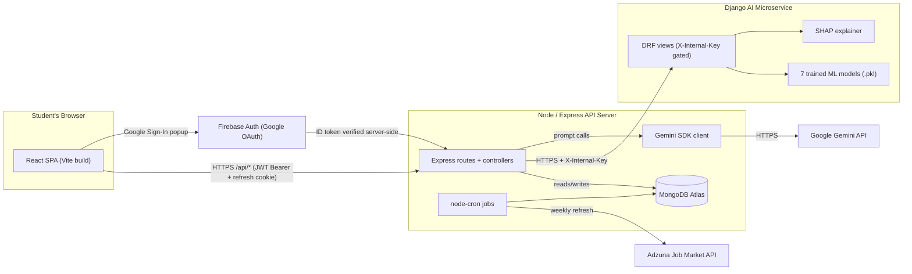
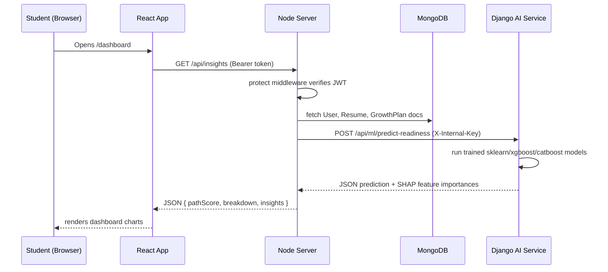
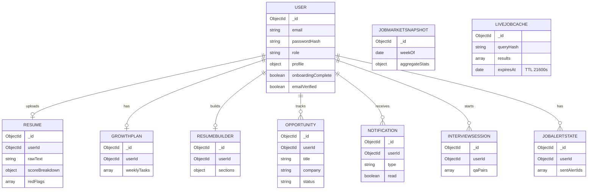
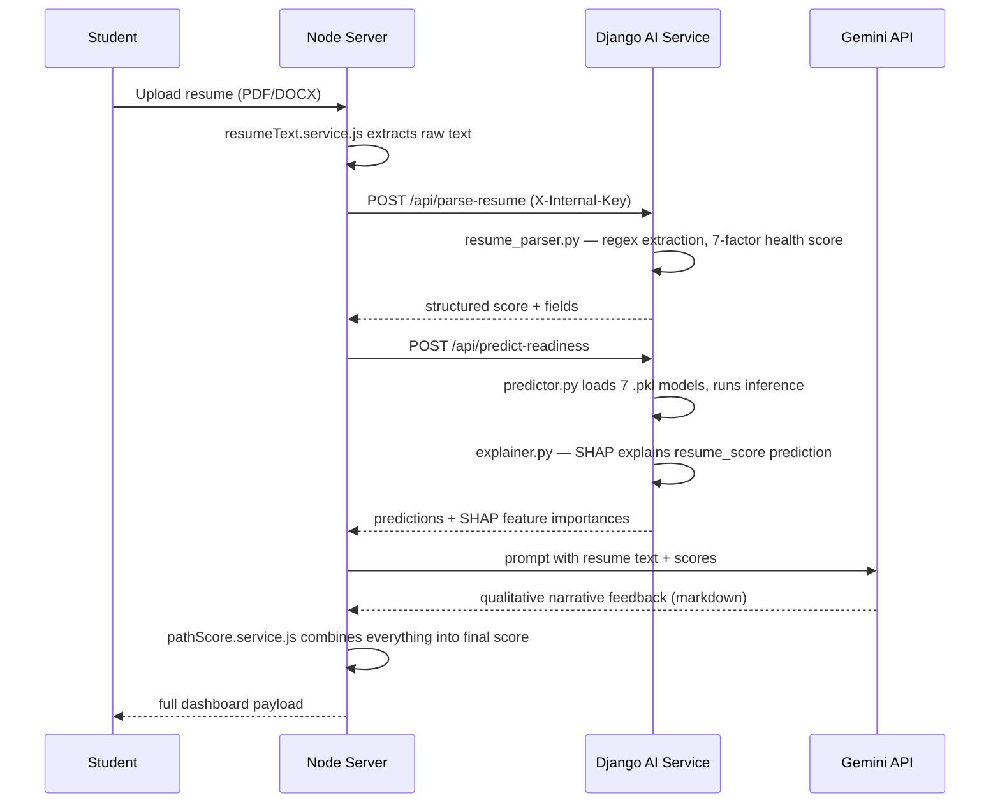

# PathPilot AI — Complete Technical Documentation

| | |
|---|---|
| **Project Version** | 1.0 (capstone submission build) |
| **Documentation Version** | 2.0 — full rewrite from source code |
| **Generated** | 2026-08-01 |
| **Scope** | `client/` (React), `server/` (Node/Express), `ai-service/` (Django) |

> **How this document was produced**: every claim below was verified by reading the actual source files in this repository — not by reading older docs or by guessing. Where the code's own comments/docstrings claimed something that turned out to be inaccurate (e.g. an ML module docstring claiming "CatBoost" when the trained model actually selected was Logistic Regression), this document states what the code **actually does**, and flags the discrepancy.

> **Companion documents** (same folder tree): [`docs/learning-guide.md`](docs/learning-guide.md) (1-day ramp-up), [`docs/interview-prep.md`](docs/interview-prep.md) (130 Q&A), [`docs/presentation-guide.md`](docs/presentation-guide.md), [`docs/ppt-guide.md`](docs/ppt-guide.md), [`docs/demo-script.md`](docs/demo-script.md), [`docs/professor-mode-review.md`](docs/professor-mode-review.md).

---

## Table of Contents

1. [Project Summary](#1-project-summary)
2. [System Architecture](#2-system-architecture)
3. [Tech Stack Reference](#3-tech-stack-reference)
4. [Repository Layout](#4-repository-layout)
5. [Client — Folder & File Reference](#5-client--folder--file-reference)
6. [Server — Folder & File Reference](#6-server--folder--file-reference)
7. [AI Service — Folder & File Reference](#7-ai-service--folder--file-reference)
8. [Full Project Flow (Walkthrough)](#8-full-project-flow-walkthrough)
9. [Feature Documentation](#9-feature-documentation)
10. [Database Schema & ER Diagram](#10-database-schema--er-diagram)
11. [API Reference](#11-api-reference)
12. [AI Pipeline — End to End](#12-ai-pipeline--end-to-end)
13. [File Dependency Maps](#13-file-dependency-maps)

---

## 1. Project Summary

**PathPilot AI** is a career-readiness platform for students. A student signs up, fills out an onboarding profile (branch, year, target role, skills), uploads a resume, and the platform:

- Parses the resume and scores it (ATS compatibility, structure, red flags).
- Computes a single **Path Score** (0–100) — the headline number that says "how ready are you for your target role right now".
- Uses Google's **Gemini** LLM plus locally-trained **ML models** to explain *why* the score is what it is and *what to do next* (a personalized weekly growth roadmap).
- Tracks job/internship applications the student is going after, and shows live job market listings pulled from a public job API.
- Runs mock interview sessions with AI-generated questions and feedback.
- Lets the student build a resume from scratch inside the app and export it as PDF/DOCX.

The system is a **3-service architecture**: a React single-page app, a Node/Express API server that owns the database and business logic, and a Django microservice that does nothing but machine learning inference. The Node server is the only thing that talks to the Django service — the browser never calls it directly.

### Why three services instead of one?

- **Separation of concerns**: Node is good at I/O-heavy web-app work (auth, CRUD, file uploads, cron jobs). Python/Django has the mature ML ecosystem (scikit-learn, XGBoost, CatBoost, SHAP) that Node doesn't.
- **Security**: the ML service is never exposed to the internet directly — it's locked behind a shared-secret header (`X-Internal-Key`) that only the Node server knows, so a student's browser can never call it directly even if they found the URL.
- **Independent scaling/deployment**: the ML service can be redeployed/retrained without touching the web server, and vice versa.

---

## 2. System Architecture



**Deployed URLs** (see `client/vercel.json`):
- Client → Vercel (static SPA)
- Server → Render, `https://pathpilot1.onrender.com`
- AI service → Render (separate service, internal-only in principle, but Render gives every service a public URL — the `X-Internal-Key` header is what actually protects it since Render doesn't support private networking between free-tier services)

### Request flow for a typical page load



---

## 3. Tech Stack Reference

| Layer | Technology | Version (from package.json / requirements.txt) | Why it was chosen |
|---|---|---|---|
| Client framework | React | 19.2.7 | Latest React, concurrent features |
| Client build tool | Vite | 8.1.1 | Fast dev server + HMR, ESM-native |
| Client routing | React Router | 7.18.1 | Standard SPA routing, nested layouts, loaders not used (data fetched in components) |
| Client styling | Tailwind CSS | 4.3.2 (CSS-first, no `tailwind.config.js`) | Utility-first, `@theme` tokens for design system |
| Client animation | Framer Motion | latest | Declarative animation, page transitions |
| Client HTTP | Axios | latest | Interceptor support for token refresh |
| Client auth (Google) | Firebase JS SDK | Auth module only | Google's OAuth popup flow is battle-tested; PathPilot does NOT use Firestore/Firebase DB, only Auth |
| Client charts | Recharts | latest | Declarative React charting for score gauges, trend lines |
| Client markdown | react-markdown + remark-gfm | latest | Renders Gemini's markdown-formatted AI responses safely |
| Client product tour | driver.js | latest | First-time-user guided tour overlay |
| Server runtime | Node.js (ESM, `"type":"module"`) | — | Modern `import`/`export` syntax throughout |
| Server framework | Express | latest | Minimal, well-understood, huge middleware ecosystem |
| Server ODM | Mongoose | latest | Schema validation + query building over MongoDB driver |
| Server database | MongoDB Atlas | M0 free tier | Document model fits variable-shape data (resume JSON, growth plans) well |
| Server auth | JWT (jsonwebtoken) + bcrypt | — | Stateless access tokens + salted password hashes (cost factor 12) |
| Server validation | Zod | — | Schema-first request validation |
| Server file parsing | pdf-parse, pdfjs-dist, mammoth | — | Extract raw text from uploaded PDF/DOCX resumes |
| Server file generation | @react-pdf/renderer, docx | — | Generate downloadable resume files from the in-app resume builder |
| Server scheduling | node-cron | — | Weekly job-market refresh, daily notification jobs |
| Server → Google | @google/genai | — | Official Gemini SDK, used for AI Coach chat + explanations |
| Server → Firebase | firebase-admin | — | Verifies Google ID tokens issued to the client |
| AI service framework | Django | 5.1–5.3 | Mature, batteries-included, DRF for REST |
| AI service API | Django REST Framework | 3.15+ | Class/function-based views, serialization |
| AI service ML | scikit-learn, XGBoost, LightGBM, CatBoost | — | Candidate algorithms compared per model; best-by-metric is kept |
| AI service explainability | SHAP | 0.45+ | Feature-importance explanations for the resume-score model |
| AI service prod server | gunicorn + WhiteNoise | — | `manage.py runserver` isn't production-safe; gunicorn serves WSGI, WhiteNoise serves static files without a separate CDN |
| Dev tooling (client) | oxlint | — | Rust-based linter, used instead of ESLint for speed |

---

## 4. Repository Layout

```
pathpilot-ai/
├── client/                  # React SPA
│   ├── src/
│   │   ├── pages/            # route-level screens
│   │   │   └── auth/          # login/register/forgot-password screens
│   │   ├── components/       # reusable UI, grouped by domain
│   │   │   ├── charts/ dashboard/ interview/ jobs/ landing/
│   │   │   ├── layout/ resume/ resumeBuilder/ tour/ ui/
│   │   ├── context/           # React Context providers (Auth, Theme, Toast)
│   │   ├── lib/                # framework-agnostic helpers (api client, utils)
│   │   ├── config/             # static config/data (nav links, career data, firebase init)
│   │   ├── routes/             # route guards
│   │   ├── App.jsx             # route tree
│   │   └── main.jsx             # React root + provider mounting
│   ├── vite.config.js
│   └── vercel.json             # prod rewrites to the Render backend
├── server/                  # Node/Express API
│   └── src/
│       ├── models/            # Mongoose schemas (10 collections)
│       ├── routes/            # Express routers (16 files)
│       ├── controllers/       # request handlers
│       ├── services/          # business logic (16 files)
│       ├── middleware/        # auth, error handling, upload, rate limit
│       ├── validators/        # Zod schemas
│       ├── utils/             # ApiError, ApiResponse, asyncHandler
│       ├── config/             # env.js, db.js, firebase.js
│       ├── scripts/            # one-off/maintenance scripts
│       ├── app.js               # Express app + middleware pipeline
│       └── index.js             # process entrypoint, cron startup
└── ai-service/               # Django ML microservice
    ├── config/                # settings.py, urls.py, wsgi.py
    ├── ml/
    │   ├── views.py             # 6 DRF endpoints
    │   ├── services/            # resume_parser, career_analysis, growth_planner, predictor, explainer
    │   ├── training/            # train_*.py scripts + train_all.py orchestrator
    │   └── models/               # trained .pkl artifacts, one folder per model
    └── requirements.txt
```

---

## 5. Client — Folder & File Reference

### 5.1 Routing (`src/App.jsx` + `src/routes/guards.jsx`)

All routes are declared in `App.jsx` using React Router v7. Five guard components wrap routes to control access:

| Guard | Behavior |
|---|---|
| `ProtectedRoute` | Redirects to `/login` if no authenticated user. Wraps every logged-in page. |
| `PublicOnlyRoute` | Redirects **away** from `/login`/`/register` if already logged in (so a logged-in user can't see the login form again). |
| `RequireOnboarding` | Redirects to `/onboarding` if the user hasn't completed their profile setup yet — prevents using the dashboard with an incomplete profile. |
| `RequireAdmin` | Restricts admin-only pages (e.g. `/admin`) to users with an admin role. |
| `StudentOnlyRoute` | Inverse of `RequireAdmin` — keeps admin accounts out of the student dashboard, redirecting them to the admin panel instead. |

### 5.2 Pages (`src/pages/`)

| Page | Route | Purpose | Key API calls |
|---|---|---|---|
| `LandingPage.jsx` | `/` | Public marketing page (light theme), sells the product before signup | none |
| `auth/LoginPage.jsx` | `/login` | Email/password + Google OAuth login | `POST /auth/login`, Firebase popup |
| `auth/RegisterPage.jsx` | `/register` | Account creation | `POST /auth/register` |
| `auth/ForgotPasswordPage.jsx` | `/forgot-password` | Requests reset email | `POST /auth/forgot-password` |
| `auth/ResetPasswordPage.jsx` | `/reset-password/:token` | Sets new password from emailed token | `POST /auth/reset-password` |
| `auth/VerifyEmailPage.jsx` | `/verify-email/:token` | Confirms email ownership | `GET /auth/verify-email/:token` |
| `OnboardingPage.jsx` | `/onboarding` | Multi-step profile setup wizard (branch, year, target role, skills) | `POST /onboarding` |
| `DashboardPage.jsx` | `/dashboard` | The 4-zone Overview dashboard (Path Score, quick stats, recent activity, recommended actions) | `GET /insights`, `GET /pathScore` |
| `ResumePage.jsx` | `/resume` | Upload/re-upload resume, view ATS/structure score breakdown | `POST /resume/upload`, `GET /resume` |
| `ResumeBuilderPage.jsx` | `/resume-builder` | In-app resume editor with live ATS scoring | `GET/PUT /resumeBuilder`, `GET /resumeBuilder/export` |
| `GrowthPlanPage.jsx` | `/growth-plan` | Weekly personalized roadmap of tasks | `GET /growth`, `PATCH /growth/task/:id` |
| `GapAnalysisPage.jsx` | `/gap-analysis` | Skill-gap breakdown vs. target role | `GET /gap` |
| `JobsPage.jsx` | `/jobs` | Live job market listings + saved/tracked opportunities with a status field | `GET /liveJobs`, `GET/POST /opportunity` |
| `InterviewPage.jsx` | `/interview` | Mock interview session UI | `POST /aiCoach/interview/start`, `POST /aiCoach/interview/answer` |
| `AiCoachPage.jsx` | `/ai-coach` | Freeform chat with the Gemini-backed coach | `POST /aiCoach/chat` |
| `ReportsPage.jsx` | `/reports` | Downloadable/printable progress report | `GET /report` |
| `ProfilePage.jsx` | `/profile` | Edit profile, avatar, notification prefs | `PUT /profile`, `POST /profile/avatar` |
| `NotificationsPage.jsx` | `/notifications` | Notification inbox | `GET /notification`, `PATCH /notification/:id/read` |
| `AdminPage.jsx` | `/admin` | Admin-only metrics/user management | `GET /admin/*` |

### 5.3 Components by folder

| Folder | Contents | Notes |
|---|---|---|
| `components/charts/` | `ScoreGauge.jsx`, trend/line chart wrappers around Recharts | `ScoreGauge` renders the circular Path Score dial; label text width was constrained to prevent overflow (recent fix) |
| `components/dashboard/` | The 4 dashboard zone components (score summary, quick stats, recent activity, recommended actions) | |
| `components/interview/` | Question card, answer input, feedback panel | |
| `components/jobs/` | Job card, filters, status badge/selector (replaced the old kanban board) | |
| `components/landing/` | Hero, feature sections, dot-grid background, CTA | Rebuilt from scratch in a recent phase — light theme, no dark/cinematic styling |
| `components/layout/` | `AppShell.jsx` (sidebar + topbar shell for all logged-in pages, owns its own `NAV_LINKS` inline — `config/nav.js` is a likely-unused duplicate), `Footer.jsx` | |
| `components/resume/` | Resume score breakdown cards, red-flag list | `HealthBreakdown.jsx` flagged as likely orphaned/unused — verify before deleting |
| `components/resumeBuilder/` | Section editors (experience, education, skills), live preview pane | |
| `components/tour/` | `driver.js` wrapper for the first-run product tour | |
| `components/ui/` | Buttons (3 variants only), inputs, cards, modals, toasts, `icons.jsx` (~50 hand-rolled SVG icons instead of an icon library) | |

### 5.4 Contexts (`src/context/`)

| Context | State it owns | Key exposed functions | Who consumes it |
|---|---|---|---|
| `AuthContext` | current user, auth loading state | `login`, `register`, `loginWithGoogle`, `logout`, `refreshUser` | route guards, `AppShell`, every page needing `user` |
| `ThemeContext` | (single light theme now — retained for structure) | `theme` | `AppShell`, a few components reading theme tokens |
| `ToastContext` | active toast queue | `success`, `error`, `info`, `warning` (⚠ **no `warn`** — a real bug was fixed where `ProfilePage.jsx` called the nonexistent `toast.warn`, which threw uncaught) | any component needing feedback toasts |

### 5.5 `src/lib/`

| File | Purpose |
|---|---|
| `api.js` | The single Axios instance every API call goes through. Implements the two-token auth pattern: short-lived access token kept in memory + localStorage, attached via request interceptor as `Authorization: Bearer`; a response interceptor catches `401`s, calls `/auth/refresh` (which relies on the HttpOnly refresh cookie) exactly once per request via a single-flight `refreshing` promise, then retries. `baseURL` resolves via `getSanitizedBaseURL()`: strips accidental quotes from `VITE_API_BASE_URL`/`VITE_API_URL`, falls back to `${window.location.origin}/api`, then `/api`. This is what makes the same build work in local dev (via Vite's proxy) and in prod (cross-domain Vercel→Render). |
| `cn.js` | Tiny hand-rolled className combiner (like `clsx`), avoids adding a dependency for one function |
| `jobMatch.js` | Client-side scoring/filtering logic for matching live job listings to the student's profile |
| `motion.js` | Shared Framer Motion variants (fade/slide presets) reused across pages |
| `useSavedJobs.js` | Custom hook wrapping saved/tracked opportunity state + API calls |

### 5.6 `src/config/`

| File | Purpose |
|---|---|
| `careerData.js` | Static reference data (role names, categories) used in onboarding dropdowns |
| `faqData.js` | Landing page FAQ content |
| `firebase.js` | Firebase client SDK initialization (Auth only) |
| `learningResources.js` | Static list of learning resource links shown in the growth plan |
| `nav.js` | Nav link list — **likely dead code**, `AppShell.jsx` defines its own `NAV_LINKS` inline instead of importing this |

### 5.7 Build tooling

- `vite.config.js`: path alias `@` → `src`; dev proxy routes `/api` and `/uploads` to `http://localhost:5000` (the local Node server) so the client never needs CORS config in dev.
- `vercel.json`: production rewrites `/api/:path*` and `/uploads/:path*` to `https://pathpilot1.onrender.com/...`, plus an SPA catch-all so client-side routes don't 404 on refresh.
- `package.json` key deps: `react@19.2.7`, `react-router-dom@7.18.1`, `tailwindcss@4.3.2`, `vite@8.1.1`.

---

## 6. Server — Folder & File Reference

### 6.1 Models (`src/models/`) — see also [§10 Database Schema](#10-database-schema--er-diagram) for full field tables

| Model | Collection | One-line purpose |
|---|---|---|
| `User.js` | users | Account, credentials, profile fields, role (student/admin) |
| `Resume.js` | resumes | Parsed resume text + score breakdown from the AI service |
| `GrowthPlan.js` | growthplans | Weekly task list generated by `growth_planner` |
| `ResumeBuilder.js` | resumebuilders | Structured resume content edited in-app (separate from uploaded `Resume`) |
| `Opportunity.js` | opportunities | A job/internship the student is tracking; exports `OPPORTUNITY_STAGES` constant used for the status field (replaced the old kanban board) |
| `Notification.js` | notifications | In-app notification inbox items |
| `InterviewSession.js` | interviewsessions | Mock interview Q&A history + feedback |
| `JobMarketSnapshot.js` | jobmarketsnapshots | Weekly aggregated job market stats (from the Adzuna cron) |
| `LiveJobCache.js` | livejobcaches | TTL-indexed cache (6 hours / 21600s) of live job search results, to avoid hitting the external API on every page load |
| `JobAlertState.js` | jobalertstates | Tracks what job alerts have already been sent to avoid duplicate notifications |

### 6.2 Routes (`src/routes/`) — full endpoint tables in [§11 API Reference](#11-api-reference)

16 route files: `auth`, `onboarding`, `profile`, `resume`, `pathScore`, `gap`, `growth`, `insights`, `opportunity`, `notification`, `aiCoach`, `report`, `admin`, `ml`, `jobMarket`, `liveJobs`, `resumeBuilder`.

### 6.3 Services (`src/services/`)

| Service | Purpose |
|---|---|
| `ai.service.js` | Gateway to the Django AI service — every call to the ML microservice goes through here, attaching `X-Internal-Key` |
| `email.service.js` | Sends verification/reset/notification emails |
| `gemini.service.js` | Wraps `@google/genai`; implements **model-fallback logic** (tries a primary Gemini model, falls back to a secondary if the first errors/is rate-limited) |
| `growth.service.js` | Orchestrates growth-plan generation, calling the AI service's roadmap endpoint and persisting the result |
| `insights.service.js` | Assembles the dashboard's combined insights payload from multiple sources |
| `jobMarket.service.js` + `jobMarketCron.js` | Fetches/aggregates job market data from Adzuna weekly |
| `liveJobs.service.js` | Live job search with the 6-hour cache layer |
| `notification.service.js` + `notificationCron.js` | Notification creation + 4 scheduled jobs (e.g. stale-profile nudges, job-alert digests) |
| `pathScore.service.js` | **The core scoring algorithm** — 5-factor weighted formula combining resume quality, skill match, experience, activity/consistency, and semester-adjusted expectations into the single Path Score. See [§9.1](#91-path-score) for the full formula. |
| `peerBenchmark.service.js` | Computes how a student compares to peers in the same branch/year |
| `resumeBuilderAts.service.js` | Live ATS scoring for the in-app resume builder (separate from the uploaded-resume scoring path) |
| `resumeBuilderExport.service.js` | Generates PDF (`@react-pdf/renderer`) / DOCX (`docx`) exports of the built resume |
| `resumeRedFlags.js` | Rule-based detection of resume red flags (gaps, generic objective statements, missing sections) |
| `resumeText.service.js` | Extracts raw text from uploaded PDF/DOCX files (`pdf-parse`, `pdfjs-dist`, `mammoth`) |
| `token.service.js` | Signs/verifies all JWTs — **purpose-scoped secrets**: access/refresh tokens use one secret, email-verification and password-reset tokens use a separate secret, so a leaked reset token can't be replayed as an access token |

### 6.4 Middleware (`src/middleware/`)

| File | Purpose |
|---|---|
| `auth.middleware.js` | `protect` — verifies the JWT Bearer token, attaches `req.user`. Applied to every route needing a logged-in user, including `/api/ml/predict` (a real missing-auth bug found in the audit and fixed) |
| `error.middleware.js` | Central error handler — catches `ApiError` instances and formats consistent JSON error responses |
| `upload.middleware.js` | Multer configuration for resume/avatar file uploads |
| `rateLimiter.middleware.js` | `authLimiter` — rate limits only the auth routes (login/register/forgot-password) against brute force; **no app-wide rate limiting exists** |

### 6.5 Utils (`src/utils/`)

`ApiError.js` / `ApiResponse.js` / `asyncHandler.js` — the three conventions used in every controller: throw `ApiError` for failures, wrap async route handlers in `asyncHandler` so thrown errors reach `error.middleware.js` instead of crashing the process, and return `ApiResponse` for consistent success payload shape (`{ success, message, data }`).

### 6.6 Config (`src/config/`)

| File | Purpose |
|---|---|
| `env.js` | Centralized env-var loading/validation |
| `db.js` | MongoDB connection setup — includes a public-DNS-resolver workaround for environments where the default DNS resolver can't complete Atlas's SRV record lookups |
| `firebase.js` | Firebase Admin SDK init; `normalizePrivateKey()` strips accidental wrapping quotes and un-escapes `\n` sequences in `FIREBASE_PRIVATE_KEY` — fixes a real production bug where pasting the key into Render's dashboard (which doesn't strip quotes the way dotenv does) broke PEM parsing |

### 6.7 App bootstrap

`app.js` middleware order: CORS → JSON/urlencoded body parsing → cookie-parser → `morgan` (dev logging only) → static file serving for avatars → a protected route for resume file downloads → all `/api/*` routers → 404 handler → central error handler. **No `helmet`, no app-wide rate limiting** (flagged in the earlier security audit as a real gap — see [`docs/professor-mode-review.md`](docs/professor-mode-review.md)).

`index.js`: connects to MongoDB, starts the two cron files, then starts the HTTP server.

---

## 7. AI Service — Folder & File Reference

### 7.1 Endpoints (`ml/views.py`) — all gated by `require_internal_key`

| View | Endpoint | Purpose |
|---|---|---|
| `health` | `GET /api/health` | Liveness check (no key required — used by Render's health check) |
| `parse_resume` | `POST /api/parse-resume` | Extracts structured data + a 100-point health score from raw resume text |
| `skill_gap` | `POST /api/skill-gap` | Compares student skills to target-role requirements |
| `predict_readiness` | `POST /api/predict-readiness` | Runs the 7-model ML ensemble, returns predictions + SHAP explanations |
| `recommend_roadmap` | `POST /api/recommend-roadmap` | Generates the weekly task roadmap |
| `predict_ml` | `POST /api/predict-ml` | Lower-level single-model prediction endpoint |

The `require_internal_key` decorator checks the `X-Internal-Key` header against `INTERNAL_API_KEY` (settings.py) — this is the **entire** access control for the service; Django REST Framework's own auth classes are deliberately left as `AllowAny` since the shared-key check happens first at the view level. `settings.py` also refuses to boot with `DEBUG=False` while `DJANGO_SECRET_KEY`/`INTERNAL_API_KEY` are still the source-visible placeholder defaults, raising `ImproperlyConfigured` — a fail-loud guard added specifically so a misconfigured production deploy can't silently run wide open.

### 7.2 Services (`ml/services/`)

| File | What it actually does | Docstring accuracy |
|---|---|---|
| `resume_parser.py` | Regex-based extraction (no ML at all) — computes a 7-factor, 100-point resume health score | Accurate |
| `career_analysis.py` | Deterministic weighted-sum scoring | Docstring claims "Random Forest" — **inaccurate**, it's a hand-written formula, not a trained model |
| `growth_planner.py` | Greedy weekly task-packing algorithm assuming 8 hours/week of student availability | Accurate |
| `predictor.py` | Loads and runs all 7 trained `.pkl` models (see table below) | Several per-model docstrings claim CatBoost when a different algorithm actually won during training — see table |
| `explainer.py` | SHAP `TreeExplainer` (for tree models) / `KernelExplainer` (fallback for non-tree models); only invoked by the combined `predict_all` path for the resume-score model | Accurate |

### 7.3 The 7 trained ML models

Each was trained by comparing 2–3 candidate algorithms and keeping the best-by-metric. **The actual winning algorithm sometimes differs from what the module's own docstring claims** — this documentation records the verified, actual winner.

| Model | Predicts | Actual algorithm (verified) | Docstring claims | Match? |
|---|---|---|---|---|
| resume_score | Resume quality score | CatBoost | CatBoost | ✅ |
| ats | ATS pass-likelihood | **Logistic Regression** | CatBoost | ❌ mismatch |
| career | Career-readiness category | CatBoost | CatBoost | ✅ |
| role | Best-fit role | **Random Forest** | CatBoost | ❌ mismatch |
| salary | Expected salary band | CatBoost | CatBoost | ✅ |
| interview | Interview-readiness | **XGBoost** | CatBoost | ❌ mismatch |
| learning | Recommended learning track | CatBoost | CatBoost | ✅ |

All are saved as generic `.pkl` files via `joblib` regardless of which library trained them — **not** native CatBoost `.cbm` format, so the "CatBoost" claim in several docstrings is doubly inaccurate (wrong algorithm *and* the save format described doesn't match what CatBoost itself would normally produce).

### 7.4 Training pipeline (`ml/training/`)

`train_resume.py` through `train_learning.py` — one script per model, each comparing 2–3 candidate algorithms (CatBoost/XGBoost/LightGBM/RandomForest/LogisticRegression/KNN depending on the model) and saving whichever scores best. `train_all.py` orchestrates running all of them in sequence.

### 7.5 Models directory

`ml/models/{ats,career,interview,learning,resume_score,role,salary}/` holds the actual trained artifacts, plus `peer_benchmarks.json` (static reference data for peer comparison). **Note**: `settings.py`'s `MODELS_DIR` (pointing at `ml/artifacts/`) is dead/unused — `predictor.py` hardcodes its own path to `ml/models/` independently. This is a real inconsistency worth knowing about if extending the service.

### 7.6 `requirements.txt` notes

Verified contents: `Django>=5.1,<5.3`, `djangorestframework>=3.15`, `django-cors-headers>=4.4`, `python-dotenv>=1.0`, `requests>=2.32`, `gunicorn>=22.0`, `whitenoise>=6.7`, `pandas>=2.2`, `numpy>=2.0`, `scikit-learn>=1.5`, `joblib>=1.4`, `xgboost>=2.0`, `lightgbm>=4.0`, `catboost>=1.2`, `shap>=0.45`. `gunicorn`/`whitenoise` were added for Render production deployment (`manage.py runserver` is dev-only). `requests` is listed but not actually used anywhere in the service. `matplotlib`/`seaborn` are used by the training scripts but are **not** listed here (they only need to be installed locally to retrain models, not in production).

---

## 8. Full Project Flow (Walkthrough)

This section narrates what happens, screen by screen, for a new student using the app for the first time.

1. **Landing (`/`)** — public marketing page. No API calls except static asset loads.
2. **Register (`/register`)** — student submits email/password (or clicks "Continue with Google", which opens a Firebase popup; the resulting ID token is verified server-side against Firebase Admin SDK). `POST /api/auth/register` creates a `User` document with a bcrypt-hashed password (cost 12), issues an access token + sets the HttpOnly refresh cookie, and (for email/password signups) sends a verification email via `email.service.js`.
3. **Onboarding (`/onboarding`)** — `RequireOnboarding` guard redirects here until the profile is complete. Student picks branch, year, target role, current skills. `POST /api/onboarding` saves this onto the `User` document.
4. **Resume upload (`/resume`)** — student uploads a PDF/DOCX. `resumeText.service.js` extracts raw text server-side, which is sent to the Django service's `/api/parse-resume` for the health-score breakdown, and separately fed to Gemini for a qualitative review. Results are saved to a new `Resume` document.
5. **Dashboard (`/dashboard`)** — on load, the client calls `GET /api/insights`, which internally: reads the student's `User`/`Resume`/`GrowthPlan` documents from MongoDB, calls the Django service's `/api/predict-readiness` (passing profile + resume features) to get the 7-model ensemble output, and calls `pathScore.service.js` to compute the final weighted Path Score. The 4 dashboard zones render from this combined payload.
6. **Growth Plan (`/growth-plan`)** — generated by `growth.service.js` calling Django's `/api/recommend-roadmap`; tasks are checkable, `PATCH /api/growth/task/:id` marks progress, which feeds back into the "activity/consistency" factor of the Path Score on next recompute.
7. **Gap Analysis (`/gap-analysis`)** — calls Django's `/api/skill-gap`, comparing the student's skill list against the target role's requirement profile.
8. **Jobs (`/jobs`)** — live listings fetched via `liveJobs.service.js` (cached 6h in `LiveJobCache`), student can save one, which creates an `Opportunity` document with a status field (Applied/Interviewing/Offer/Rejected — from `OPPORTUNITY_STAGES`) — replacing an earlier kanban-board UI with a simpler status dropdown.
9. **Interview (`/interview`)** — starts an `InterviewSession`; each question/answer round trips through `aiCoach.controller.js` to Gemini for question generation and answer feedback.
10. **AI Coach (`/ai-coach`)** — freeform chat, also Gemini-backed, with conversation history persisted per session.
11. **Reports (`/reports`)** — a printable/exportable snapshot of the student's overall progress.
12. **Notifications** — populated by the two cron jobs in `notificationCron.js` (e.g., "you haven't updated your resume in 30 days", "3 new jobs match your target role").
13. **Logout** — clears the access token from memory/localStorage, calls `POST /api/auth/logout` to clear the refresh cookie server-side, and navigates to the landing page **before** clearing auth state client-side (a specific ordering fix — clearing auth state first would trigger `ProtectedRoute` to redirect to `/login` mid-navigation instead of landing cleanly on `/`).

---

## 9. Feature Documentation

### 9.1 Path Score

**Purpose**: give the student one number that answers "how ready am I, right now, for my target role."

**Why a weighted formula instead of a single ML model**: a single learned score would be a black box the student can't act on. A transparent weighted formula lets the growth plan point at exactly which factor is weakest.

**Frontend**: `DashboardPage.jsx`, `components/charts/ScoreGauge.jsx`.
**Backend**: `services/pathScore.service.js`, called from `insights.service.js`.
**Database**: reads `User`, `Resume`, `GrowthPlan`.
**External call**: Django `/api/predict-readiness` for the ML-derived sub-scores that feed into the formula.

**Formula** (5 weighted factors, recently revised to a "realistic" version with an experience factor and semester-based caps):
1. Resume quality (from the AI-service resume health score)
2. Skill match to target role
3. Experience factor (projects/internships reported in onboarding)
4. Activity/consistency (growth-plan task completion rate)
5. Semester-adjusted expectation cap (a first-semester student isn't expected to score as high as a final-semester student on experience — prevents unrealistic low scores from unfairly penalizing early-year students, and prevents unrealistic high scores for a senior with a thin profile)

**Limitations**: weights are hand-tuned, not learned from outcome data (no ground-truth "did this student get hired" signal exists to train against).

### 9.2 Resume Scoring & Red Flags

**Frontend**: `ResumePage.jsx`, `components/resume/*`.
**Backend**: `resumeText.service.js` (extraction) → Django `/api/parse-resume` (structured scoring) → `resumeRedFlags.js` (rule-based flags) → Gemini (qualitative narrative feedback).
**Output**: a 100-point breakdown across 7 factors, plus a list of specific red flags (e.g. "no quantified achievements", "objective statement is generic").

### 9.3 Growth Plan (Roadmap)

**Backend**: `growth.service.js` → Django `growth_planner.py`, a **greedy task-packing algorithm** assuming 8 hours/week of available study time, prioritizing tasks that close the largest skill gaps first.
**Limitation**: the 8hr/week assumption is fixed, not configurable per student.

### 9.4 Live Jobs & Opportunity Tracking

**Backend**: `liveJobs.service.js` (external Adzuna API + `LiveJobCache`, 6-hour TTL) and `opportunity.controller.js`/`Opportunity.js` (student's own tracked applications). These were previously two separate concepts rendered inconsistently in two places — deduplicated into one `/jobs` page with a simple status field, replacing an earlier kanban board implementation.

### 9.5 Mock Interviews

**Backend**: `aiCoach.controller.js` + `gemini.service.js`, persisted per `InterviewSession`. Questions are generated per-session (not a static bank), and feedback is generated per-answer.

### 9.6 AI Coach Chat

Freeform chat backed by Gemini with model-fallback logic in `gemini.service.js` (tries a primary model, falls back to a secondary on error/rate-limit) so a single Gemini outage/quota issue doesn't fully break the feature.

### 9.7 Resume Builder

**Frontend**: `ResumeBuilderPage.jsx` + `components/resumeBuilder/*`.
**Backend**: `resumeBuilderAts.service.js` (live ATS scoring as the student edits) + `resumeBuilderExport.service.js` (PDF via `@react-pdf/renderer`, DOCX via the `docx` package).
**Note**: this is a **separate** data model (`ResumeBuilder.js`) from the uploaded-resume flow (`Resume.js`) — a student can have both an uploaded resume being scored, and a from-scratch builder document, independently.

---

## 10. Database Schema & ER Diagram



`JobMarketSnapshot` is not tied to a specific user (global weekly market data); `LiveJobCache` is keyed by search-query hash, not by user, so it's shared across all students searching similar terms.

---

## 11. API Reference

All routes are mounted under `/api`. Auth: 🔒 = requires `protect` middleware (valid Bearer access token). 🔑 = Django-side, requires `X-Internal-Key`.

| Method | Path | Auth | Purpose |
|---|---|---|---|
| POST | `/auth/register` | — | Create account |
| POST | `/auth/login` | — | Email/password login |
| POST | `/auth/google` | — | Google OAuth login (verifies Firebase ID token) |
| POST | `/auth/refresh` | — (cookie) | Mint new access token from refresh cookie |
| POST | `/auth/logout` | 🔒 | Clear refresh cookie |
| POST | `/auth/forgot-password` | — | Send reset email (anti-enumeration: same response whether or not the email exists) |
| POST | `/auth/reset-password` | — | Set new password from token |
| GET | `/auth/verify-email/:token` | — | Confirm email |
| POST | `/onboarding` | 🔒 | Save onboarding profile |
| GET/PUT | `/profile` | 🔒 | Read/update profile |
| POST | `/profile/avatar` | 🔒 | Upload avatar image |
| POST | `/resume/upload` | 🔒 | Upload + score resume |
| GET | `/resume` | 🔒 | Get current resume + score |
| GET | `/pathScore` | 🔒 | Get computed Path Score |
| GET | `/gap` | 🔒 | Skill-gap analysis |
| GET | `/growth` | 🔒 | Get growth plan |
| PATCH | `/growth/task/:id` | 🔒 | Toggle task completion |
| GET | `/insights` | 🔒 | Combined dashboard payload |
| GET/POST | `/opportunity` | 🔒 | List/create tracked opportunities |
| PATCH | `/opportunity/:id` | 🔒 | Update status |
| GET | `/notification` | 🔒 | List notifications |
| PATCH | `/notification/:id/read` | 🔒 | Mark read |
| POST | `/aiCoach/chat` | 🔒 | Freeform AI chat |
| POST | `/aiCoach/interview/start` | 🔒 | Start mock interview |
| POST | `/aiCoach/interview/answer` | 🔒 | Submit answer, get feedback |
| GET | `/report` | 🔒 | Progress report |
| GET | `/admin/*` | 🔒 (admin) | Admin metrics/user management |
| POST | `/ml/predict` | 🔒 | Proxy to Django's predict-readiness (fixed: previously missing `protect`) |
| GET | `/jobMarket` | 🔒 | Weekly market snapshot |
| GET | `/liveJobs` | 🔒 | Live job search (cached) |
| GET/PUT | `/resumeBuilder` | 🔒 | Resume builder content |
| GET | `/resumeBuilder/export` | 🔒 | Export PDF/DOCX |

Django service (all internal, called only by the Node server):

| Method | Path | Auth | Purpose |
|---|---|---|---|
| GET | `/api/health` | — | Liveness check |
| POST | `/api/parse-resume` | 🔑 | Structured resume scoring |
| POST | `/api/skill-gap` | 🔑 | Skill-gap comparison |
| POST | `/api/predict-readiness` | 🔑 | Full 7-model ensemble + SHAP |
| POST | `/api/recommend-roadmap` | 🔑 | Weekly task roadmap |
| POST | `/api/predict-ml` | 🔑 | Single-model prediction |

---

## 12. AI Pipeline — End to End



**Why this order**: deterministic/statistical scoring (Django) runs first because it's cheap, fast, and doesn't depend on an external network call — Gemini (an external LLM API with latency and cost) is only invoked once the numeric picture is already known, so its role is narrative explanation, not the scoring itself.

---

## 13. File Dependency Maps

### Resume upload feature
```
ResumePage.jsx
  → api.js (POST /resume/upload)
    → resume.routes.js
      → resume.controller.js
        → resumeText.service.js (extraction)
        → ai.service.js → Django /api/parse-resume
        → resumeRedFlags.js
        → gemini.service.js (narrative feedback)
        → Resume.js (persist)
```

### Path Score / Dashboard feature
```
DashboardPage.jsx
  → api.js (GET /insights)
    → insights.routes.js → insights.controller.js
      → insights.service.js
        → pathScore.service.js
        → ai.service.js → Django /api/predict-readiness
        → GrowthPlan.js, Resume.js, User.js (reads)
  → components/charts/ScoreGauge.jsx (renders)
```

### Auth (login) feature
```
LoginPage.jsx
  → api.js (POST /auth/login)
    → auth.routes.js → auth.controller.js
      → User.js (lookup + bcrypt.compare)
      → token.service.js (sign access + refresh JWTs)
      → sets HttpOnly refresh cookie
  ← AuthContext.login() stores access token via setAccessToken()
  ← route guards re-evaluate (ProtectedRoute / RequireOnboarding)
```
