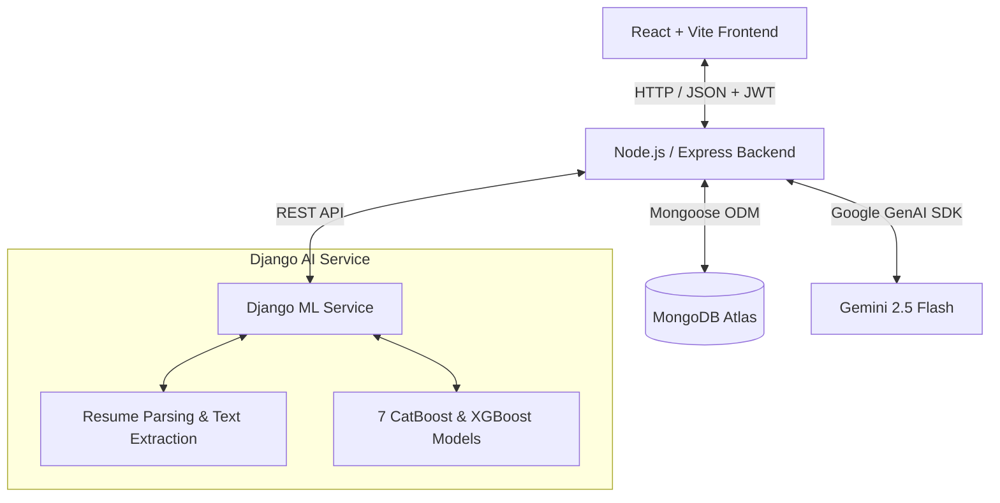
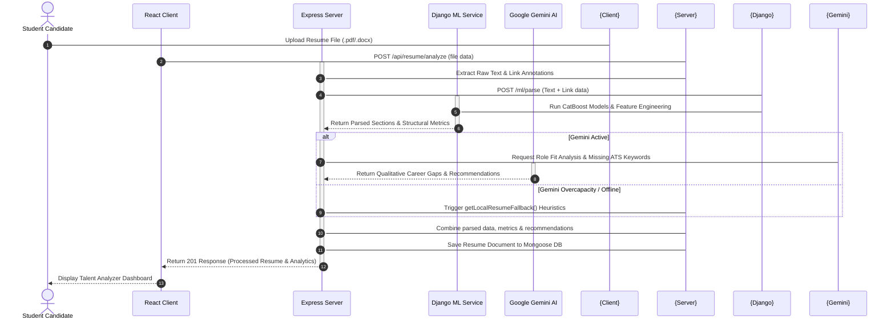

# PathPilot AI: Complete System Documentation & Architectural Guide

> **Navigate Your Career. Powered by Intelligence.**

PathPilot AI is an advanced, enterprise-ready **Career Intelligence Platform** built for students and early-career professionals. Rather than matching candidates with arbitrary job postings, PathPilot serves as a comprehensive **Career Operating System**, helping users diagnose their skill gaps, audit and improve their resumes, follow personalized, dynamically adjusted learning roadmaps, prep with real-time AI mock interview coaching, and track their job opportunities in one unified command center.

---

## 1. System Architecture & Dual-Engine Pipeline

PathPilot uses a resilient **Dual-Engine (ML + LLM) Hybrid Architecture** to merge data-driven statistical model predictions with context-aware generative AI.



### Flow execution rules:
1. **Frontend Isolation**: The React client communicates **only** with the Node.js API Gateway (proxied through Vite via `/api`).
2. **Business & DB Gateway**: Node.js owns authentication, security guards, persistent schemas, cron tasks, and file storage.
3. **Python ML Engine (Inference)**: When a resume is uploaded, Node.js extracts the raw text and sends it to the Django ML service. Django runs deterministic regex extraction and uses **7 trained CatBoost/XGBoost models** to calculate structural metrics (e.g. peer benchmarks, ATS formatting compliance).
4. **LLM Cognitive Layer (Personalization)**: Node.js takes Django's metrics and sends them along with the resume text to Google Gemini. Gemini acts as the cognitive layer, generating qualitative gaps, career roadmaps, and custom interview questions.
5. **Overload Resiliency**: If Gemini throws a `503 Overcapacity` or `429 Rate Limit` error, Node falls back to a custom **local heuristic engine** to generate high-fidelity fallback suggestions and scores, ensuring the application onboarding never crashes.

---

## 2. Core Functional Modules & Feature Details

### 2.1 Authentication & Session Architecture
*   **Token-Based Flow**: Uses short-lived access tokens (held in-memory and `localStorage` on the client) and secure `httpOnly` refresh cookies.
*   **Security Guards**: Route-level React wrappers:
    *   `ProtectedRoute`: Directs unauthenticated traffic to `/login`.
    *   `PublicOnlyRoute`: Prevents logged-in users from seeing the auth pages.
    *   `RequireOnboarding`: Automatically redirects fresh signups to the onboarding wizard if they haven't set their profile parameters.
    *   `RequireAdmin` / `StudentOnlyRoute`: Enforces role-based access control (RBAC).

### 2.2 Onboarding Wizard (`/onboarding`)
*   A premium multi-step onboarding wizard.
*   Guides the user to define their:
    *   Target Dream Role (e.g., Frontend Developer, Data Analyst).
    *   Current academic status (College, Major, Semester).
    *   Core technical skills they want to track.
*   Updates the student's status, enabling dashboard access.

### 2.3 Resume Strategy & Talent Analyzer (`/talent-analyzer`)
*   **Text & Annotation Parsing**: Supports PDF/DOCX uploads, extracting raw text and links (e.g., GitHub, LinkedIn).
*   **Structure Analyzer**:
    *   **Django parsing**: Extracts sections (Education, Projects, Work Experience, Certifications).
    *   **Gemini analysis**: Appends role-fit scores, ATS keyword checks (matching vs. missing keywords), strength areas, next-step priorities, and direct recommendations.
*   **Recruiter Red Flags**: Runs a specialized local ruleset that scans the resume text for red flags:
    *   *Formatting*: Excessive length, too many bullet points, lack of metrics.
    *   *Contact Info*: Missing email, phone number, LinkedIn link, or GitHub link.
    *   *Projects/Experience*: Vague descriptions, passive language.

### 2.4 Skill Roadmap & Execution Engine (`/execution-engine`)
*   **Dynamic Learning Roadmaps**: Compiles the missing technical skills identified during the resume audit into a week-by-week learning syllabus.
*   **Task Management**: Each week provides structured lessons, external resources, and exactly 3 actionable technical tasks.
*   **Progress Tracking**: Users check off completed tasks. Recharts visualization tracks cumulative hours spent and roadmap completion rate.

### 2.5 AI Mock Interview Coach (`/interview-prep`)
*   **Interactive Sessions**: Launches a mock interview for the user's dream role.
*   **Audio-to-Text Integration**: Supports live voice recording using the Web Audio API, feeding the voice response directly into the text evaluator.
*   **Live Session Timers**: Displays cumulative timers and countdown helpers.
*   **Comprehensive Evaluation**: Analyzes user responses against role-specific interview rubrics (Depth, Relevance, and Communication), providing scores, constructive feedback, and sample answers.

### 2.6 Opportunity Tracker (`/execution-engine`)
*   A kanban board tracking job/internship applications.
*   **Columns**: Bookmarked, Applied, Interviewing, Offered, Rejected.
*   Allows custom opportunity creation with details like Role Title, Company Name, Salary, and Deadline, and links opportunities directly to active resume revisions.

### 2.7 Career Report & Printable Audits
*   Compiles all academic metrics, path scores, and resume audits into a single, beautifully structured printable layout.
*   Supports print style CSS overrides (`@media print`) so users can export their complete career profile to PDF with zero layout distortions.

### 2.8 The Admin Ledger (`/admin`)
*   A command dashboard restricted to users with `role: "admin"`.
*   **Overview Tab**: Displays total registered users, resume uploads, average path score, and active learning roadmaps.
*   **Users Tab**: A searchable table of all registered accounts with inline actions to toggle roles, edit credentials, or view student cards.

### 2.9 Profile & Settings Page (`/profile`)
*   **Avatar Upload Frame**: Supports instant profile photo upload (`POST /api/profile/avatar`) with a clean drag-and-drop overlay.
*   **Academic Identity Forms**: Allows updating Name, Target Role, College, Major, Semester, and tracked skills.
*   **Security Card**: Built-in password modification panel.
*   **Public Visibility Panel**: Toggles the public portfolio card. Displays a sharing link to the candidate's public landing card.

---

## 3. Database Schema Models (Mongoose)

### 3.1 `User`
Tracks credentials, roles, onboarding status, and basic profile parameters.
```javascript
{
  name: { type: String, required: true },
  email: { type: String, required: true, unique: true },
  password: { type: String, required: true },
  role: { type: String, enum: ['student', 'admin'], default: 'student' },
  isVerified: { type: Boolean, default: false },
  onboardingCompleted: { type: Boolean, default: false },
  isPublicCardEnabled: { type: Boolean, default: false },
  publicCardId: { type: String, unique: true },
  profile: {
    college: String,
    branch: String,
    semester: Number,
    dreamRole: String,
    skills: [String],
    avatarUrl: String,
    resumeUrl: String
  }
}
```

### 3.2 `Resume`
Persists the raw parser extraction and Gemini analytics results.
```javascript
{
  user: { type: Schema.Types.ObjectId, ref: 'User', required: true },
  fileUrl: String,
  originalName: String,
  skills: [String],
  education: [Object],
  projects: [Object],
  experience: [Object],
  certifications: [String],
  contact: Object,
  healthScore: Number,
  redFlags: [{ key: String, label: String, severity: String, message: String }],
  roleFitScore: Number,
  keyGaps: [String],
  strengthAreas: [String],
  atsKeywordsPresent: [String],
  atsKeywordsMissing: [String],
  aiRecommendations: [String],
  nextStepPriority: String,
  aiNarrative: String
}
```

### 3.3 `GrowthPlan`
Tracks the learning weeks and tasks generated from the skills audit.
```javascript
{
  user: { type: Schema.Types.ObjectId, ref: 'User', required: true },
  targetRole: String,
  weeks: [{
    weekNumber: Number,
    topic: String,
    focus: String,
    isCompleted: { type: Boolean, default: false },
    tasks: [{
      name: String,
      hours: Number,
      isCompleted: { type: Boolean, default: false }
    }]
  }]
}
```

---

## 4. Complete Project Directory Structure

```
pathpilot-ai/
├── client/                      # React Frontend Application (Vite-powered)
│   ├── src/
│   │   ├── main.jsx             # React application mount point
│   │   ├── App.jsx              # React routes and guards configuration
│   │   ├── index.css            # Core design system stylesheet
│   │   ├── assets/              # Static media assets
│   │   ├── config/              # Frontend configuration variables
│   │   ├── context/             # Global React state providers
│   │   │   ├── AuthContext.jsx  # Authentication state & silent login flow
│   │   │   └── ToastContext.jsx # Sleek notification toasts
│   │   ├── lib/
│   │   │   ├── api.js           # Axios client with interceptors
│   │   │   └── cn.js            # Tailwind/CSS merging helper
│   │   ├── routes/
│   │   │   └── guards.jsx       # Route security wrappers (ProtectedRoute)
│   │   ├── components/
│   │   │   ├── charts/          # Analytics data visualization charts
│   │   │   ├── layout/
│   │   │   │   └── AppShell.jsx # Base shell with TopNav and AI Coach drawer
│   │   │   ├── opportunity/     # Kanban columns for Opportunity Tracker
│   │   │   ├── resume/          # Resume upload & parsed content cards
│   │   │   └── ui/              # Reusable premium glassmorphic UI elements
│   │   └── pages/
│   │       ├── OnboardingPage.jsx
│   │       ├── OverviewPage.jsx
│   │       ├── TalentAnalyzerPage.jsx
│   │       ├── ExecutionEnginePage.jsx
│   │       ├── InterviewPrepPage.jsx
│   │       ├── ProfilePage.jsx
│   │       ├── PublicProfilePage.jsx
│   │       ├── AdminPage.jsx
│   │       ├── NotFoundPage.jsx
│   │       └── auth/            # Auth pages (Login, Register, Password Reset)
│   └── package.json
│
├── server/                      # Node.js Express Backend
│   ├── src/
│   │   ├── index.js             # Starts HTTP server & Mongoose DB connection
│   │   ├── app.js               # Sets up Express app, CORS, and API routes
│   │   ├── config/
│   │   │   └── env.js           # Environment configurations (JWT, Gemini keys)
│   │   ├── middleware/
│   │   │   ├── auth.middleware.js
│   │   │   └── upload.middleware.js
│   │   ├── models/              # Mongoose Database Schemas
│   │   ├── controllers/         # API Endpoint Route Controllers
│   │   │   ├── auth.controller.js
│   │   │   ├── resume.controller.js
│   │   │   ├── gap.controller.js
│   │   │   ├── growth.controller.js
│   │   │   ├── aiCoach.controller.js
│   │   │   ├── profile.controller.js
│   │   │   └── admin.controller.js
│   │   ├── routes/              # Express API Routes
│   │   ├── services/            # Core business log services
│   │   │   ├── ai.service.js    # Client proxy for Django ML requests
│   │   │   ├── gemini.service.js # Google GenAI SDK interface with Fallback
│   │   │   ├── pathScore.service.js # PathScore formula constructor
│   │   │   ├── resumeRedFlags.js    # Local ruleset evaluator
│   │   │   └── resumeText.service.js # raw PDF/DOCX parsed text extractor
│   │   ├── utils/
│   │   └── validators/          # Route validation schemas (Joi/Zod)
│   └── package.json
│
└── ai-service/                  # Django Machine Learning Engine
    ├── manage.py                # Django manager utility
    ├── requirements.txt         # Python virtual environment dependencies
    ├── ml/
    │   ├── urls.py              # Router for ML/Parser endpoints
    │   ├── views.py             # View controller handling parsing requests
    │   ├── services/            # Custom processing services
    │   ├── data/                # Dataset loaders
    │   ├── artifacts/           # Trained models binaries (CatBoost, XGBoost)
    │   └── training/            # Pipeline model training scripts
    │       ├── train_ats.py     # Trains ATS probability CatBoost model
    │       ├── train_career.py  # Trains readiness classifier
    │       ├── train_role.py    # Trains role fit regressor
    │       └── train_all.py     # Master script to run training routines
    └── config/
        ├── settings.py          # Django backend configuration settings
        └── urls.py              # Main Django router
```

---

## 5. Summary of System Integration Flow



This dual-engine architecture guarantees a production-grade, highly personal career diagnostics platform that functions securely and gracefully under any external API load conditions.
